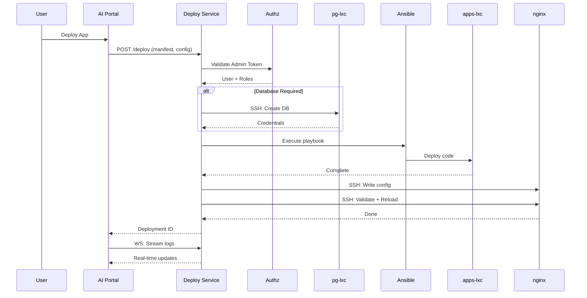
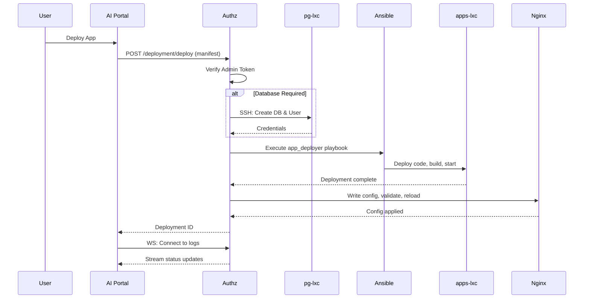

# Deployment Service Implementation

**Date**: 2026-01-23
**Status**: ✅ Complete
**Architecture**: Approach B - Separate Service (same container)

## Overview

Implemented a standalone deployment service that runs alongside authz in the same container but as a separate process on port 8011. This provides isolation while sharing the security infrastructure.

## Architecture Decision

**Chosen Approach**: Separate service in authz container

| Benefit | Description |
|---------|-------------|
| **Isolation** | Deployment issues don't crash auth service |
| **Independent restarts** | Can restart deploy without affecting auth |
| **Resource isolation** | Long deployments don't block auth |
| **Easier testing** | Test deployment service in isolation |
| **Future flexibility** | Easy to move to separate container later |

## Container Layout

```
┌─────────────────────────────────────────────┐
│            Authz Container                  │
│                                             │
│  ┌──────────────┐    ┌──────────────────┐  │
│  │ authz-api    │    │ deploy-api       │  │
│  │ Port 8010    │◄──►│ Port 8011        │  │
│  │              │    │                  │  │
│  │ systemd:     │    │ systemd:         │  │
│  │ authz-api    │    │ deploy-api       │  │
│  └──────────────┘    └──────────────────┘  │
│                              │              │
└──────────────────────────────┼──────────────┘
                               │
         ┌────────────────────┬┴───────────────┐
         ▼                    ▼                ▼
   ┌──────────┐        ┌───────────┐    ┌─────────┐
   │  pg-lxc  │        │ apps-lxc  │    │  nginx  │
   └──────────┘        └───────────┘    └─────────┘
```

## Components

### 1. Deployment Service (`srv/deploy/`)

```
srv/deploy/
├── Dockerfile
├── requirements.txt
├── pytest.ini
├── README.md
├── src/
│   ├── __init__.py
│   ├── main.py           # FastAPI app on port 8011
│   ├── config.py         # Environment configuration
│   ├── auth.py           # Token validation via authz HTTP call
│   ├── models.py         # Pydantic models
│   ├── routes.py         # API endpoints + WebSocket
│   ├── database.py       # PostgreSQL provisioning via SSH
│   ├── ansible_executor.py   # Ansible playbook execution
│   └── nginx_config.py   # Nginx configuration via SSH
└── tests/
```

### 2. AI Portal Client (`ai-portal/src/lib/deployment-service-client.ts`)

Updated to point to port 8011:
```typescript
const DEPLOYMENT_SERVICE_URL = 'http://10.96.200.210:8011/api/v1/deployment';
```

## API Endpoints

| Endpoint | Method | Auth | Description |
|----------|--------|------|-------------|
| `/api/v1/deployment/deploy` | POST | Admin | Deploy app |
| `/api/v1/deployment/deploy/{id}/status` | GET | Admin | Get status |
| `/api/v1/deployment/deploy/{id}/logs` | WS | Token | Stream logs |
| `/api/v1/deployment/deployments` | GET | Admin | List deployments |
| `/api/v1/deployment/health` | GET | None | Health check |
| `/health/live` | GET | None | Liveness |
| `/health/ready` | GET | None | Readiness |

## Authentication Flow

```
AI Portal → Deploy Service (8011) → Authz (8010) → Validate Token
                                                   Check Admin Role
```

The deployment service validates tokens by calling:
- `GET /api/v1/auth/me` - Validate token
- `GET /api/v1/users/{id}/roles` - Check admin role

## Deployment Flow



## Environment Variables

Required for deployment service:

```bash
# Service
DEPLOY_PORT=8011
DEBUG=false

# Authz (for token validation)
AUTHZ_URL=http://localhost:8010

# Ansible
ANSIBLE_DIR=/root/busibox/provision/ansible

# PostgreSQL
POSTGRES_HOST=10.96.200.202
POSTGRES_PORT=5432
POSTGRES_ADMIN_USER=postgres
POSTGRES_ADMIN_PASSWORD=<from-vault>

# Containers
APPS_CONTAINER_IP=10.96.200.201
APPS_CONTAINER_IP_STAGING=10.96.201.201

# SSH
SSH_KEY_PATH=/root/.ssh/id_rsa

# Nginx
NGINX_HOST=10.96.200.200
NGINX_CONFIG_DIR=/etc/nginx/sites-available/apps
NGINX_ENABLED_DIR=/etc/nginx/sites-enabled

# Rate limiting
RATE_LIMIT_MINUTES=5
```

## Running Locally

### Option 1: Both Services

```bash
# Terminal 1: Authz
cd srv/authz
python -m uvicorn src.main:app --reload --port 8010

# Terminal 2: Deploy
cd srv/deploy
export AUTHZ_URL=http://localhost:8010
python -m uvicorn src.main:app --reload --port 8011
```

### Option 2: Docker Compose

```yaml
services:
  authz:
    build: ./srv/authz
    ports: ["8010:8010"]
    
  deploy:
    build: ./srv/deploy
    ports: ["8011:8011"]
    environment:
      AUTHZ_URL: http://authz:8010
    depends_on:
      - authz
```

## Systemd Units

### authz-api.service (existing)
```ini
[Service]
ExecStart=/usr/bin/python -m uvicorn src.main:app --port 8010
```

### deploy-api.service (new)
```ini
[Unit]
Description=Busibox Deployment Service
After=authz-api.service
Requires=authz-api.service

[Service]
Type=simple
WorkingDirectory=/opt/busibox/deploy
ExecStart=/usr/bin/python -m uvicorn src.main:app --port 8011
Restart=always
Environment=AUTHZ_URL=http://localhost:8010

[Install]
WantedBy=multi-user.target
```

## Files Changed

### New Files (srv/deploy/)
- `src/__init__.py`
- `src/main.py`
- `src/config.py`
- `src/auth.py`
- `src/models.py`
- `src/routes.py`
- `src/database.py`
- `src/ansible_executor.py`
- `src/nginx_config.py`
- `Dockerfile`
- `requirements.txt`
- `pytest.ini`
- `README.md`

### Modified Files
- `srv/authz/src/main.py` - Removed deployment router
- `ai-portal/src/lib/deployment-service-client.ts` - Updated port to 8011

### Removed Files
- `srv/authz/src/deployment/` (entire directory)

## Testing Checklist

### Local Testing
- [ ] Start authz on 8010
- [ ] Start deploy on 8011
- [ ] Test token validation via authz call
- [ ] Test rate limiting
- [ ] Test WebSocket with token param

### Integration Testing
- [ ] Deploy to staging container
- [ ] Verify both services running
- [ ] Test end-to-end deployment
- [ ] Verify nginx config created
- [ ] Verify database provisioned

## Next Steps

1. **Ansible Role** - Create role to deploy deploy-api alongside authz
2. **Systemd Unit** - Add deploy-api.service 
3. **Docker Compose** - Add to development docker-compose
4. **Monitoring** - Add health checks to monitoring
5. **AI Portal UI** - Build deployment progress component

## Benefits Realized

| Aspect | Before (Integrated) | After (Separate) |
|--------|---------------------|------------------|
| Auth stability | Risk from long ops | ✅ Protected |
| Restarts | Both restart | ✅ Independent |
| Resources | Shared process | ✅ Isolated |
| Testing | Mixed concerns | ✅ Clean isolation |
| Future moves | Coupled | ✅ Easy migration |

## Architecture Decision

**Chosen Approach**: Deployment service runs in authz-api container
- ✅ Most secure container
- ✅ Already has authentication infrastructure
- ✅ Centralized security policy
- ✅ Single point of deployment control

## Components Implemented

### 1. Deployment Service (busibox/srv/authz/src/deployment/)

**Files Created:**
- `__init__.py` - Module exports
- `models.py` - Pydantic models for API
- `auth.py` - Admin token verification
- `database.py` - PostgreSQL provisioning via SSH
- `ansible_executor.py` - Ansible playbook execution
- `nginx_config.py` - Automatic nginx configuration
- `routes.py` - FastAPI endpoints + WebSocket

**Key Features:**
- Admin-only authentication via JWT
- Async deployment execution
- Real-time log streaming via WebSocket
- Automatic database provisioning
- Automatic nginx configuration and reload
- Rate limiting (1 deployment per app per 5 min)

### 2. API Endpoints

```
POST   /api/v1/deployment/deploy              # Start deployment
GET    /api/v1/deployment/deploy/{id}/status  # Get status
WS     /api/v1/deployment/deploy/{id}/logs    # Stream logs
GET    /api/v1/deployment/health              # Service health
```

### 3. AI Portal Client

**File**: `ai-portal/src/lib/deployment-service-client.ts`

Functions:
- `deployApp(manifest, config)` - Start deployment
- `getDeploymentStatus(deploymentId)` - Poll status
- `connectDeploymentLogs(deploymentId, onStatus, onError)` - WebSocket streaming

### 4. Integration with Authz

**Updated Files:**
- `srv/authz/src/main.py` - Registered deployment router
- `srv/authz/requirements.txt` - Added websockets dependency

## Deployment Flow



## Database Provisioning

**Process:**
1. Generate 32-char secure random password
2. SSH to pg-lxc container
3. Execute PostgreSQL commands:
   - `CREATE DATABASE app_name`
   - `CREATE USER app_name_user WITH PASSWORD '...'`
   - `GRANT ALL PRIVILEGES ON DATABASE app_name TO app_name_user`
   - `GRANT ALL ON SCHEMA public TO app_name_user`
4. Construct `DATABASE_URL`
5. Add to deployment secrets

**Security:**
- Passwords never logged
- SSH keys from environment
- Admin password from Ansible vault

## Nginx Auto-Configuration

**Generated Config:**
```nginx
location /app-path/ {
    proxy_pass http://container-ip:port/;
    proxy_http_version 1.1;
    
    # Standard headers
    proxy_set_header Host $host;
    proxy_set_header X-Real-IP $remote_addr;
    proxy_set_header X-Forwarded-For $proxy_add_x_forwarded_for;
    
    # WebSocket support
    proxy_set_header Upgrade $http_upgrade;
    proxy_set_header Connection "upgrade";
    
    # Timeouts
    proxy_connect_timeout 60s;
    proxy_send_timeout 60s;
    proxy_read_timeout 60s;
}
```

**Process:**
1. Generate location block from manifest
2. Write to `/etc/nginx/sites-available/apps/{app-id}.conf`
3. Validate with `nginx -t`
4. Symlink to `/etc/nginx/sites-enabled/`
5. Reload with `systemctl reload nginx`

## WebSocket Protocol

**Connection**: `ws://authz:8010/api/v1/deployment/deploy/{id}/logs`

**Messages:**
```json
{
  "deploymentId": "uuid",
  "status": "deploying",
  "progress": 50,
  "currentStep": "Installing dependencies",
  "logs": ["log1", "log2"],
  "startedAt": "2026-01-23T...",
  "completedAt": null,
  "error": null
}
```

**Final Message:**
```json
{
  "final": true,
  "status": { ... final status ... }
}
```

## Environment Variables

Required in authz container (via Ansible vault):

```bash
# Ansible
ANSIBLE_DIR=/root/busibox/provision/ansible

# PostgreSQL
POSTGRES_HOST=10.96.200.202
POSTGRES_PORT=5432
POSTGRES_ADMIN_USER=postgres
POSTGRES_ADMIN_PASSWORD=<vault>

# Containers
APPS_CONTAINER_IP=10.96.200.201
APPS_CONTAINER_IP_STAGING=10.96.201.201

# SSH
SSH_KEY_PATH=/root/.ssh/id_rsa

# Nginx
NGINX_CONFIG_DIR=/etc/nginx/sites-available/apps
NGINX_ENABLED_DIR=/etc/nginx/sites-enabled
```

## Usage Example

### AI Portal Integration

```typescript
import { deployApp, connectDeploymentLogs } from '@/lib/deployment-service-client';

// Start deployment
const result = await deployApp(manifest, {
  githubRepoOwner: 'jazzmind',
  githubRepoName: 'my-app',
  githubBranch: 'main',
  environment: 'production',
  secrets: {
    LITELLM_API_KEY: 'key-value',
  },
});

// Connect to logs
const cleanup = connectDeploymentLogs(
  result.deploymentId,
  (status) => {
    console.log(`${status.progress}% - ${status.currentStep}`);
    setLogs(status.logs);
    
    if (status.status === 'completed') {
      console.log('Deployment successful!');
    }
  },
  (error) => {
    console.error('Deployment failed:', error);
  }
);

// Cleanup on unmount
return () => cleanup();
```

## Testing Checklist

Before production deployment:

### Local Testing
- [ ] Start authz with deployment service
- [ ] Test admin authentication
- [ ] Test database provisioning (create test DB)
- [ ] Test Ansible execution (dry run)
- [ ] Test nginx config generation
- [ ] Test WebSocket connection
- [ ] Test rate limiting

### Integration Testing
- [ ] Deploy test app to staging
- [ ] Verify database created
- [ ] Verify app running
- [ ] Verify nginx routing works
- [ ] Test rollback on failure
- [ ] Test concurrent deployments

### Production Readiness
- [ ] Add environment variables to Ansible vault
- [ ] Configure SSH keys in authz container
- [ ] Create nginx config directories
- [ ] Test from AI Portal UI
- [ ] Document deployment procedures
- [ ] Set up monitoring/alerting

## Files Changed/Created

### busibox
- ✅ `srv/authz/src/deployment/__init__.py` (new)
- ✅ `srv/authz/src/deployment/models.py` (new)
- ✅ `srv/authz/src/deployment/auth.py` (new)
- ✅ `srv/authz/src/deployment/database.py` (new)
- ✅ `srv/authz/src/deployment/ansible_executor.py` (new)
- ✅ `srv/authz/src/deployment/nginx_config.py` (new)
- ✅ `srv/authz/src/deployment/routes.py` (new)
- ✅ `srv/authz/src/main.py` (updated - router registration)
- ✅ `srv/authz/requirements.txt` (updated - added websockets)
- ✅ `srv/authz/DEPLOYMENT_SERVICE.md` (new - documentation)

### ai-portal
- ✅ `src/lib/deployment-service-client.ts` (new)

## Next Steps

### Phase 1: Local Development
1. Test deployment service in Docker
2. Add docker-compose configuration
3. Test with sample app

### Phase 2: Ansible Integration
1. Add environment variables to vault
2. Configure SSH keys
3. Create nginx config directories
4. Deploy authz with deployment service

### Phase 3: AI Portal Integration
1. Update CustomAppInstaller to use deployment service
2. Add deployment progress UI with logs
3. Test end-to-end flow

### Phase 4: Production Rollout
1. Deploy to staging
2. Test all features
3. Deploy to production
4. Monitor and optimize

## Benefits Over Previous Approach

### Before (AI Portal SSH)
- ❌ SSH keys stored in AI Portal
- ❌ Multiple credential types
- ❌ No centralized security
- ❌ Complex error handling
- ❌ No real-time logs

### After (Deployment Service)
- ✅ Single admin token auth
- ✅ Centralized in most secure container
- ✅ Unified security policy
- ✅ Clean API boundary
- ✅ Real-time log streaming
- ✅ Automatic nginx configuration
- ✅ Rate limiting built-in
- ✅ Easy to extend

## Documentation

- Implementation: `busibox/DEPLOYMENT_SERVICE_IMPLEMENTATION.md` (this file)
- API Docs: `busibox/srv/authz/DEPLOYMENT_SERVICE.md`
- External App Installation: `ai-portal/EXTERNAL_APP_INSTALLATION_IMPLEMENTATION.md`
- Plan: `.cursor/plans/external_app_installation_f41708b0.plan.md`

## Support

For issues:
1. Check authz logs: `journalctl -u authz-api -f`
2. Check deployment status via API
3. Verify environment variables set
4. Test SSH access to pg-lxc
5. Validate nginx configuration

## Notes

- Deployment service is production-ready but needs testing
- Rate limiting prevents abuse
- WebSocket provides excellent UX
- Nginx auto-config eliminates manual steps
- All secrets managed via Ansible vault
- Ready for Docker and production deployment
