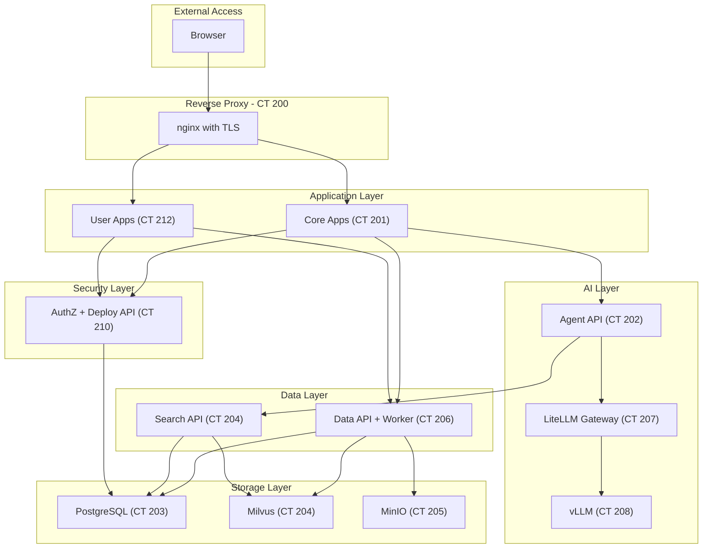

# Busibox Architecture Overview

**Created**: 2025-12-09  
**Last Updated**: 2026-02-12  
**Status**: Active  
**Category**: Architecture  
**Related Docs**:  
- `architecture/01-containers.md`  
- `architecture/02-ai.md`  
- `architecture/03-authentication.md`  
- `architecture/04-ingestion.md`  
- `architecture/05-search.md`  
- `architecture/06-agents.md`  
- `architecture/07-apps.md`  
- `architecture/08-tests.md`  
- `architecture/09-databases.md`

## Overview
Busibox is a self-hosted AI infrastructure platform that runs on Docker or Proxmox LXC containers. The platform delivers secure document ingestion, hybrid search, AI agent orchestration, and custom application hosting while enforcing role-based access control and Row-Level Security (RLS) in PostgreSQL.

## System Architecture

## Core Principles
- **Isolation-first**: One major concern per container; shared nothing beyond the bridge network.
- **RBAC everywhere**: JWTs carry role permissions; services translate them into RLS session variables.
- **Zero Trust**: RS256-signed JWTs verified via JWKS; no static tokens; audience-bound token exchange.
- **Deterministic pipelines**: Ingestion writes to MinIO -> PostgreSQL -> Milvus; search reads from Milvus + Postgres partitions.
- **Infrastructure as code**: Containers defined in `provision/pct/vars.env`; configuration and deployment via Ansible. Works on both Docker and Proxmox backends.
- **Hybrid AI stack**: liteLLM gateway fronts local and cloud inference engines:
  - **vLLM** for NVIDIA GPUs (runs in container)
  - **MLX** for Apple Silicon (runs on host via host-agent)
  - Cloud providers (OpenAI, Anthropic, AWS Bedrock, etc.)
  - Per-agent, per-task model selection

## End-to-End Flow (Happy Path)
1. **AuthZ token issued** by the `authz` service (CT 210) for a user and their document roles.
2. **Upload** goes to the Data API (CT 206): file is stored in MinIO, metadata + visibility recorded in PostgreSQL, job queued in Redis.
3. **Processing** worker (same CT 206) extracts text (Marker/pdfplumber/ColPali), chunks, embeds (FastEmbed + optional ColPali visual), and indexes to Milvus; RLS metadata is kept in PostgreSQL.
4. **Search** service (CT 204) receives JWT, builds allowed partitions (personal + role-based), performs hybrid search (Milvus vectors + BM25), optional rerank via liteLLM.
5. **Apps** (CT 201, 212) present UI (AI Portal, Agent Manager, custom apps) and proxy internal calls; they never expose data/search directly.
6. **Agent API** (CT 202) orchestrates agent requests: routes to specialized sub-agents, calls Search API for RAG retrieval, calls liteLLM for synthesis, streams responses via SSE.

## Data Plane
- **Object Storage**: MinIO in `files-lxc` stores originals and derived artifacts.
- **Databases**: PostgreSQL in `pg-lxc` hosts per-service databases:
  - `agent_server` - Agent definitions, conversations, workflows
  - `authz` - Users, roles, sessions, audit logs
  - `files` - File metadata, ingestion status, chunks
  - `ai_portal` - Portal-specific data (Prisma managed)
  - Plus test databases (`test_agent_server`, `test_authz`, `test_files`) for pytest isolation
- **Vectors**: Milvus in `milvus-lxc` stores embeddings; partitions align to users/roles.
- **Queue**: Redis Streams in `data-lxc` coordinates ingestion jobs.

## Control Plane
- **liteLLM gateway** in `litellm-lxc` normalizes LLM calls and reranker access. Routes to local (vLLM, MLX) or cloud providers.
- **AuthZ** in `authz-lxc` issues RS256 JWTs, manages RBAC, and records audit events in PostgreSQL.
- **Deploy API** (co-located with AuthZ, CT 210) provides runtime app deployment and service orchestration.
- **Docs API** (co-located with Agent API, CT 202) serves platform documentation and OpenAPI specifications.
- **Host Agent** (Apple Silicon only) runs on the host machine to control MLX, which requires direct hardware access.
- **Provisioning/Config**: Proxmox scripts in `provision/pct/`, Ansible roles in `provision/ansible/`.

## Service Inventory

| Container | CTID | Services | Port(s) |
|-----------|------|----------|---------|
| proxy-lxc | 200 | nginx | 80, 443 |
| core-apps-lxc | 201 | AI Portal, Agent Manager, core apps | 3000+ |
| agent-lxc | 202 | Agent API, Docs API | 8000, 8004 |
| pg-lxc | 203 | PostgreSQL | 5432 |
| milvus-lxc | 204 | Milvus, Search API | 19530, 8003 |
| files-lxc | 205 | MinIO | 9000, 9001 |
| data-lxc | 206 | Data API, Data Worker, Embedding API, Redis | 8002, 8005, 6379 |
| litellm-lxc | 207 | LiteLLM gateway | 4000 |
| vllm-lxc | 208 | vLLM inference, ColPali | 8080 |
| authz-lxc | 210 | AuthZ, Deploy API | 8010, 8011 |
| bridge-lxc | 211 | Bridge (Signal, Email) | 8081 |
| user-apps-lxc | 212 | User-deployed applications | varies |

## Key Features
- **Hybrid AI**: Local models (vLLM, MLX) + frontier providers (OpenAI, Bedrock), selectable per agent and per task
- **Unified data model**: Documents, app data, and agent conversations all flow through the same permission-aware infrastructure
- **Granular security**: RLS by user and group; agents inherit user permissions; no unintended data leakage
- **Sophisticated document processing**: Multi-strategy extraction, LLM cleanup, semantic chunking, hybrid embeddings
- **Agent tools**: Document search (RAG), web search, crawlers, custom tools
- **App development platform**: Vibe-code Next.js apps with `@jazzmind/busibox-app` library; deploy to portal with instant AI/data/security integration

See the referenced component documents for detail on responsibilities, interfaces, and operational notes.
