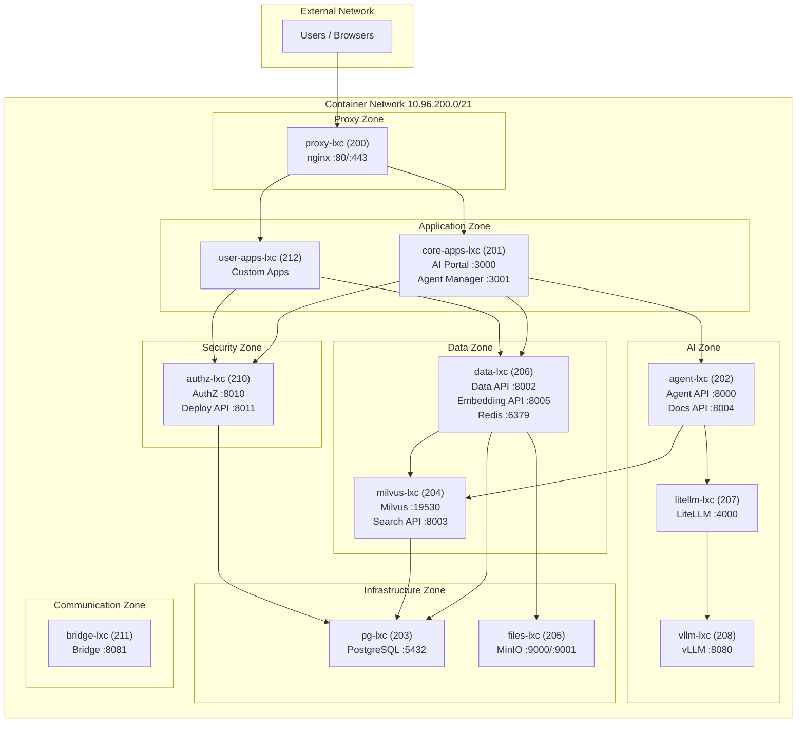

# Container Topology

**Created**: 2025-12-09  
**Last Updated**: 2026-02-12  
**Status**: Active  
**Category**: Architecture  
**Related Docs**:  
- `architecture/00-overview.md`  
- `architecture/02-ai.md`  
- `architecture/03-authentication.md`  
- `architecture/04-ingestion.md`  
- `architecture/05-search.md`  
- `architecture/06-agents.md`  
- `architecture/07-apps.md`

## Network
- **Bridge**: `vmbr0`
- **CIDR**: `10.96.200.0/21` (production), `10.96.201.0/21` (staging)
- **Gateway**: `10.96.200.1`
- **Definition**: `provision/pct/vars.env` (authoritative CTIDs/IPs)

## Container Topology

## Container Inventory

| Container | CTID | IP | Purpose | Key Ports | Notes |
| --- | --- | --- | --- | --- | --- |
| `proxy-lxc` | 200 | 10.96.200.200 | nginx reverse proxy | 80/443 | Fronts apps; terminates TLS in production. |
| `core-apps-lxc` | 201 | 10.96.200.201 | Next.js core apps (AI Portal, Agent Manager, etc.) | 3000+, proxied via 80/443 | Managed by supervisord (Docker) or systemd (Proxmox). |
| `agent-lxc` | 202 | 10.96.200.202 | Agent API, Docs API | 8000 (Agent), 8004 (Docs) | Agent orchestration with tool calling and SSE streaming. |
| `pg-lxc` | 203 | 10.96.200.203 | PostgreSQL (multi-database) | 5432 | RLS policies enforced. Separate databases per service: `agent_server`, `authz`, `files`, `ai_portal`. |
| `milvus-lxc` | 204 | 10.96.200.204 | Milvus vector DB, Search API | 19530 (Milvus), 8003 (Search) | Document embeddings; partitioned by user/role. Search API co-located for low-latency queries. |
| `files-lxc` | 205 | 10.96.200.205 | MinIO object storage | 9000 (S3), 9001 (console) | Holds originals and derived artifacts. |
| `data-lxc` | 206 | 10.96.200.206 | Data API + worker + Embedding API + Redis | 8002 (API), 8005 (Embed), 6379 (Redis) | Internal-only API for upload/status/search/embeddings. |
| `litellm-lxc` | 207 | 10.96.200.207 | liteLLM gateway | 4000 | Fronts vLLM/MLX/cloud providers; used by data worker, search, and agent. |
| `vllm-lxc` | 208 | 10.96.200.208 | vLLM inference, ColPali | 8080 (vLLM) | GPU-capable local model serving. ColPali visual embeddings on port 9006. |
| `authz-lxc` | 210 | 10.96.200.210 | AuthZ service, Deploy API | 8010 (AuthZ), 8011 (Deploy) | Issues RS256 JWTs, manages RBAC, records audit events. Deploy API handles app deployments. |
| `bridge-lxc` | 211 | 10.96.200.211 | Bridge (Signal, Email) | 8081 | Multi-channel communication bridge. |
| `user-apps-lxc` | 212 | 10.96.200.212 | User-deployed applications | varies | Sandboxed container for user apps deployed via Deploy API. |

### Host Services (Docker Development Only)

On Apple Silicon Macs, some services run on the host instead of in containers:

| Service | Port | Purpose | Notes |
| --- | --- | --- | --- |
| `host-agent` | 8089 | MLX control bridge | Allows Docker to control MLX on the host |
| `mlx-lm` | 8080 | Local LLM inference | MLX-LM server for Apple Silicon |

The host-agent is necessary because MLX requires direct access to Apple Silicon hardware, which is not available inside Docker containers. Deploy-API communicates with host-agent via `host.docker.internal:8089`.

## Responsibilities & Traffic
- **North-south**: Users hit proxy -> apps; no direct public access to data/search/authz.
- **East-west**:
  - Apps -> Data API (`/upload`, `/status`, `/files`) for ingestion lifecycle.
  - Apps -> Search API (`/search`) for hybrid retrieval.
  - Apps -> Agent API (`/api/chat`, `/api/agents`) for agent interactions.
  - Data Worker -> Milvus, MinIO, PostgreSQL, liteLLM (via Embedding API).
  - Search -> Milvus (co-located) and PostgreSQL for metadata.
  - Agent -> Search API for RAG retrieval, liteLLM for synthesis.
  - AuthZ -> PostgreSQL for audit writes; apps call AuthZ to exchange tokens.
  - Deploy API -> Apps containers for runtime app deployment.

## Service Co-Location Summary

Some containers host multiple services for efficiency:

| Container | Primary Service | Co-Located Services |
|-----------|----------------|-------------------|
| agent-lxc (202) | Agent API | Docs API |
| milvus-lxc (204) | Milvus | Search API |
| data-lxc (206) | Data API | Data Worker, Embedding API, Redis |
| authz-lxc (210) | AuthZ | Deploy API |

## Operational Sources of Truth
- **Provisioning**: `provision/pct/*.sh` + `vars.env`
- **Configuration**: `provision/ansible/roles/*` group vars and templates
- **Service code**: `srv/data`, `srv/search`, `srv/authz`, `srv/agent`, `srv/deploy`, `srv/docs`, `srv/embedding`, `srv/bridge`
- **Docker**: `docker-compose.yml` with service definitions for all services

See individual component documents for API contracts and pipeline details.
