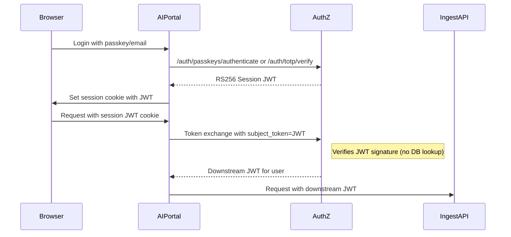
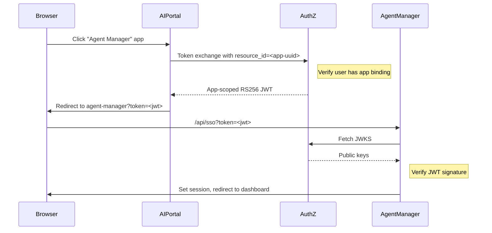

# Authentication & Authorization

**Created**: 2025-12-09  
**Last Updated**: 2026-02-12  
**Status**: Active  
**Category**: Architecture  
**Related Docs**:  
- `architecture/01-containers.md`  
- `architecture/04-ingestion.md`  
- `architecture/05-search.md`  
- `architecture/07-apps.md`

---

## Zero Trust Architecture

Busibox implements a Zero Trust authentication architecture where:

1. **AuthZ is the sole authentication authority** - All session JWTs are issued by authz
2. **Cryptographic verification** - Session JWTs are RS256-signed; downstream services verify signatures, no DB lookups required
3. **Subject token exchange** - User operations use session JWTs as `subject_token`; no client credentials needed
4. **Explicit delegation** - Background tasks require user-authorized delegation tokens
5. **No static admin tokens** - All operations use JWT-based auth; service accounts for server-to-server calls

### Authentication Methods by Context

| Context | Authentication Method | Example |
|---------|----------------------|---------|
| **User login** | Public auth endpoints | Magic link, TOTP, passkey verification |
| **User operations** | Session JWT (subject_token exchange) | Uploading files, searching, chat |
| **Admin operations** | Admin user's JWT with admin role | Managing users, roles, apps |
| **Server background tasks** | Service account JWT (client_credentials) | Audit logging, cleanup jobs |
| **Service-to-service** | Service account JWT (client_credentials) | Ingest calling keystore |

> **Important**: There are NO static admin tokens or client credentials for user operations. All authentication uses JWTs - either user session JWTs or service account JWTs. This is a true Zero Trust architecture with no trusted subsystems.

### Authentication Flow



### Key Principles

1. **Cryptographic verification** - All tokens are JWTs signed by authz; no DB lookups required for basic validation
2. **User identity in every request** - Session JWT contains user identity; downstream tokens derive from it
3. **No service credentials for user operations** - Client credentials only for true service-to-service (no user context)
4. **Explicit delegation** - Users must authorize background tasks; delegation tokens are scoped and time-limited
5. **Revocation support** - JTI tracking allows immediate session/delegation revocation

---

## Implementation Notes

### Zero Trust - No Trusted Subsystems

This is a true Zero Trust architecture. Key points:

1. **No admin tokens**: There is no `AUTHZ_ADMIN_TOKEN` or similar static credential
2. **No client credentials for user operations**: User-initiated actions always use the user's JWT
3. **Service accounts for server-to-server**: Background tasks and service-to-service calls use service account JWTs
4. **Session cookie**: Named `busibox-session`, contains the RS256-signed session JWT
5. **Authentication endpoints are public**: Magic link, TOTP, and passkey verification endpoints don't require authentication - they ARE the authentication

### How Authentication Works

| Scenario | Authentication Method |
|----------|----------------------|
| User login (magic link, TOTP, passkey) | Public authz endpoints - no auth required |
| User operations (upload, search, chat) | User's session JWT exchanged for access token |
| Admin operations (manage users/roles) | Admin user's JWT (user with Admin role) |
| Background tasks (cleanup, audit) | Service account JWT (created via client_credentials) |

### busibox-app Library

The `@jazzmind/busibox-app` library provides:

- `validateSession()` - Validate session JWT locally or against authz
- `useMagicLink()`, `verifyTotpCode()` - Complete login flows (public endpoints)
- `exchangeTokenZeroTrust()` - Exchange session JWT for downstream access tokens
- RBAC functions with optional `accessToken` parameter for authenticated calls

---

## Design Goals

1. **Multi-provider authentication**: Authz service supports authenticating users via EntraID, SAML, other SSO, as well as via email + passkey/TOTP.
2. **Role-based access with OAuth2 scopes**: Roles are assigned to users and contain OAuth2 scopes which control access to services and data. Users can have multiple roles; their effective scopes are the union of all role scopes.
3. **JWT session tokens**: When a user authenticates, they receive an RS256-signed JWT session token from authz.
4. **Subject token exchange**: ai-portal exchanges session JWTs for audience-bound access tokens using OAuth2 token exchange (RFC 8693). No client credentials required for user operations.
5. **Asymmetric signing (RS256)**: All tokens use asymmetric key signing. Keys are stored in PostgreSQL and published via JWKS.
6. **Row-level security**: Files, embeddings, chunks, summaries, insights and other generated data use PostgreSQL RLS based on roles. Milvus partitions align with role IDs. MinIO object paths are organized by visibility (personal/role) with access validated at the application layer.

---

## Authorization Model

### Two-Dimensional Access Control

Access control has two orthogonal dimensions:

| Dimension | Controlled By | Question Answered |
|-----------|---------------|-------------------|
| **Data Access** | Role membership | "Which data can I see?" |
| **Operations** | OAuth2 scopes | "What can I do with it?" |

### Example: Finance Department

```
┌─────────────────────────────────────────────────────────────┐
│                    FINANCE DOCUMENTS                         │
│              (tagged with Finance roles)                     │
└─────────────────────────────────────────────────────────────┘
                          │
          ┌───────────────┴───────────────┐
          ▼                               ▼
┌──────────────────────┐     ┌──────────────────────┐
│   Finance Admin      │     │    Finance Team       │
│                      │     │                       │
│ Roles: [finance]     │     │ Roles: [finance]      │
│                      │     │                       │
│ Scopes:              │     │ Scopes:               │
│  • ingest.read       │     │  • ingest.read        │
│  • ingest.write      │     │  • search.read        │
│  • ingest.delete     │     │  • agent.read         │
│  • search.read       │     │                       │
│  • search.write      │     │                       │
│  • search.delete     │     │                       │
│  • agent.read        │     │                       │
│  • agent.write       │     │                       │
│  • agent.delete      │     │                       │
│                      │     │                       │
│ Can: View, edit,     │     │ Can: View finance     │
│      delete finance  │     │      documents only   │
│      documents       │     │                       │
└──────────────────────┘     └──────────────────────┘
```

Both groups have `finance` role membership → they can ACCESS finance-tagged documents.
Only Finance Admin has write/delete scopes → they can MODIFY those documents.

### Standard OAuth2 Scopes

| Scope | Service | Permission |
|-------|---------|------------|
| `ingest.read` | Ingest API | View files, status, metadata |
| `ingest.write` | Ingest API | Upload files, update metadata |
| `ingest.delete` | Ingest API | Delete files and associated data |
| `search.read` | Search API | Execute searches, view results |
| `search.write` | Search API | Modify search configurations |
| `search.delete` | Search API | Delete search artifacts |
| `agent.read` | Agent API | Query agents, view responses |
| `agent.write` | Agent API | Create/modify agents |
| `agent.delete` | Agent API | Delete agents |
| `agent.execute` | Agent API | Execute agent tasks |

---

## AuthZ Service

| Property | Value |
|----------|-------|
| **Containers** | CT 210 (Production), CT 310 (Test) |
| **Code** | `srv/authz` |
| **Port** | 8010 |
| **Issuer** | `busibox-authz` (configurable via `AUTHZ_ISSUER`) |

### Endpoints

**OAuth2 & Token Management:**

| Endpoint | Method | Description |
|----------|--------|-------------|
| `/.well-known/jwks.json` | GET | Public JWKS for token validation |
| `/oauth/token` | POST | Issue access tokens (subject_token, client_credentials) |
| `/oauth/delegation` | POST | Create delegation token for background tasks |
| `/oauth/delegations` | GET | List user's delegation tokens (requires session JWT) |
| `/oauth/delegations/{jti}` | DELETE | Revoke a delegation token |

**Authentication:**

| Endpoint | Method | Description |
|----------|--------|-------------|
| `/auth/passkeys/challenge` | POST | Create WebAuthn challenge |
| `/auth/passkeys` | POST | Register new passkey |
| `/auth/passkeys/authenticate` | POST | Login with passkey → returns session JWT |
| `/auth/totp` | POST | Create TOTP code (sends email) |
| `/auth/totp/verify` | POST | Verify TOTP code → returns session JWT |
| `/auth/magic-links` | POST | Create magic link (sends email) |
| `/auth/magic-links/{token}/use` | POST | Use magic link → returns session JWT |
| `/auth/sessions/{token}` | GET | Validate session |
| `/auth/sessions/{token}` | DELETE | Logout (delete session) |

**Administration:**

| Endpoint | Method | Description |
|----------|--------|-------------|
| `/admin/roles` | CRUD | Role management (includes scopes) |
| `/admin/user-roles` | POST/DELETE | User-role bindings |
| `/admin/oauth-clients` | CRUD | OAuth client management |
| `/internal/sync/user` | POST | Sync user + roles from ai-portal |
| `/authz/audit` | POST | Append audit log entries |
| `/health/live` | GET | Liveness probe |
| `/health/ready` | GET | Readiness probe |

### Configuration

| Environment Variable | Default | Description |
|---------------------|---------|-------------|
| `AUTHZ_ISSUER` | `busibox-authz` | Token issuer (iss claim) |
| `AUTHZ_ACCESS_TOKEN_TTL` | `900` | Access token TTL in seconds (15 min) |
| `AUTHZ_SESSION_TOKEN_TTL` | `604800` | Session JWT TTL in seconds (7 days) |
| `AUTHZ_SIGNING_ALG` | `RS256` | Signing algorithm |
| `AUTHZ_RSA_KEY_SIZE` | `2048` | RSA key size |
| `AUTHZ_KEY_ENCRYPTION_PASSPHRASE` | - | Encrypt private keys at rest |
| `AUTHZ_BOOTSTRAP_CLIENT_ID` | - | Bootstrap OAuth client on startup |
| `AUTHZ_BOOTSTRAP_CLIENT_SECRET` | - | Bootstrap client secret |
| `AUTHZ_BOOTSTRAP_ALLOWED_AUDIENCES` | `ingest-api,search-api,agent-api,authz-api` | Allowed audiences for bootstrap client |
| `POSTGRES_HOST` | - | PostgreSQL host |
| `POSTGRES_DB` | `busibox` | Database name |
| `POSTGRES_USER` | `busibox_user` | Database user |
| `POSTGRES_PASSWORD` | - | Database password |

### Service Accounts

Instead of using static admin tokens, services authenticate using OAuth client credentials (service accounts). This provides:

1. **Scoped access** - Each service account has specific allowed scopes
2. **Revocation** - Service accounts can be disabled without redeploying
3. **Audit trail** - All operations are logged with the service account identity
4. **Rotation** - Secrets can be rotated independently

**Standard Service Accounts:**

| Client ID | Purpose | Scopes |
|-----------|---------|--------|
| `ai-portal` | Frontend authentication flows | `authz.auth.*` |
| `ai-portal-system` | Background operations (audit, cleanup) | `authz.audit.write`, `authz.users.read` |
| `ingest-api` | Ingest service operations | `authz.keystore.*` |
| `search-api` | Search service operations | (none - read-only JWT validation) |
| `agent-api` | Agent service operations | (none - read-only JWT validation) |

### AuthZ Admin Scopes

For operations that require elevated privileges (user management, role management, etc.), the following scopes are used:

| Scope | Permission |
|-------|------------|
| `authz.users.read` | Read user information |
| `authz.users.write` | Create/update users |
| `authz.users.delete` | Delete users |
| `authz.roles.read` | Read role information |
| `authz.roles.write` | Create/update roles |
| `authz.audit.read` | Read audit logs |
| `authz.audit.write` | Write audit events |
| `authz.bindings.read` | Read role-resource bindings |
| `authz.bindings.write` | Create/update bindings |
| `authz.keystore.read` | Read encryption keys |
| `authz.keystore.write` | Create/rotate encryption keys |

**User-initiated admin operations** (e.g., admin panel in ai-portal) use the logged-in admin user's session JWT, exchanged for an `authz-api` access token with the required scopes.

**Server-initiated operations** (e.g., audit logging during login) use the service account's client credentials.

---

## OAuth2 Token Flows

### Subject Token Exchange (Zero Trust - Recommended)

For exchanging a user's session JWT for an audience-bound access token:

```http
POST /oauth/token
Content-Type: application/x-www-form-urlencoded

grant_type=urn:ietf:params:oauth:grant-type:token-exchange&
subject_token=<session-jwt>&
subject_token_type=urn:ietf:params:oauth:token-type:jwt&
audience=ingest-api
```

Response:
```json
{
  "access_token": "<audience-bound-jwt>",
  "token_type": "Bearer",
  "expires_in": 900,
  "scope": "ingest.read ingest.write search.read"
}
```

**Key points:**
- No `client_id` or `client_secret` required
- AuthZ verifies the session JWT signature cryptographically
- User's roles and scopes are looked up in the database
- Issued token is bound to the requested audience

### App-Scoped Token Exchange (External Apps)

For granting users access to external apps (like agent-manager), ai-portal exchanges the user's session JWT for an app-scoped access token. AuthZ verifies the user has access to the app via RBAC bindings before issuing the token.

```http
POST /oauth/token
Content-Type: application/x-www-form-urlencoded

grant_type=urn:ietf:params:oauth:grant-type:token-exchange&
subject_token=<session-jwt>&
subject_token_type=urn:ietf:params:oauth:token-type:jwt&
audience=Agent%20Manager&
resource_id=<app-uuid>
```

Response:
```json
{
  "access_token": "<app-scoped-jwt>",
  "token_type": "Bearer",
  "expires_in": 900,
  "scope": "agent.read agent.write search.read"
}
```

**Key points:**
- `resource_id` is the app's UUID from ai-portal's App table
- AuthZ checks user has access to the app via RBAC bindings: `user → role → app binding`
- If user doesn't have access, returns 403 `user_does_not_have_app_access`
- Issued token includes `app_id` claim for the app to verify
- Token contains only roles that grant access to the specific app
- External app validates token via JWKS: `GET /.well-known/jwks.json`

**Flow:**


**App-Scoped Token Claims:**
```json
{
  "iss": "authz-api",
  "sub": "<user-uuid>",
  "aud": "Agent Manager",
  "exp": 1703123456,
  "iat": 1703122556,
  "jti": "<unique-token-id>",
  "typ": "access",
  "scope": "agent.read agent.write search.read",
  "roles": [
    { "id": "<role-uuid>", "name": "Admin" }
  ],
  "app_id": "<app-uuid>"
}
```

### Chained Token Exchange (App to Downstream Service)

External apps can exchange their app-scoped token for downstream service tokens. This allows apps to call backend services (agent-api, search-api, etc.) on behalf of the user:

```http
POST /oauth/token
Content-Type: application/x-www-form-urlencoded

grant_type=urn:ietf:params:oauth:grant-type:token-exchange&
subject_token=<app-scoped-jwt>&
subject_token_type=urn:ietf:params:oauth:token-type:jwt&
audience=agent-api
```

Response:
```json
{
  "access_token": "<agent-api-jwt>",
  "token_type": "Bearer",
  "expires_in": 900,
  "scope": "agents:read agents:write"
}
```

**Key points:**
- The app-scoped token (with `typ: "access"` and `app_id` claim) is used as subject_token
- AuthZ verifies the token signature and extracts the user identity
- The user's roles and scopes are looked up fresh from the database
- Issued token is bound to the requested downstream audience (e.g., `agent-api`)

### Client Credentials Grant (Service-to-Service)

For service-to-service authentication (no user context):

```http
POST /oauth/token
Content-Type: application/x-www-form-urlencoded

grant_type=client_credentials&
client_id=ai-portal&
client_secret=<secret>&
audience=ingest-api
```

Response:
```json
{
  "access_token": "<jwt>",
  "token_type": "Bearer",
  "expires_in": 900,
  "scope": ""
}
```

### Legacy Token Exchange (Deprecated)

For backward compatibility only - use subject token exchange instead:

```http
POST /oauth/token
Content-Type: application/x-www-form-urlencoded

grant_type=urn:ietf:params:oauth:grant-type:token-exchange&
client_id=ai-portal&
client_secret=<secret>&
audience=ingest-api&
requested_subject=<user-uuid>&
requested_purpose=document-upload
```

**Note:** This mode requires client credentials and trusts the client to assert user identity.
Prefer subject token exchange for Zero Trust compliance.

---

## Token Structures

### Session Token (typ: session)

Issued when user authenticates (passkey, TOTP, magic link):

```json
{
  "iss": "busibox-authz",
  "sub": "<user-uuid>",
  "aud": "ai-portal",
  "exp": 1703727056,
  "iat": 1703122256,
  "nbf": 1703122256,
  "jti": "<session-id>",
  "typ": "session",
  "email": "user@example.com"
}
```

**Properties:**
- Long TTL (7 days default)
- Used as `subject_token` for downstream token exchange
- JTI is the session ID for revocation tracking
- Stored in `busibox-session` cookie

### Access Token (typ: access)

Issued via token exchange for downstream services:

```json
{
  "iss": "busibox-authz",
  "sub": "<user-uuid>",
  "aud": "ingest-api",
  "exp": 1703123456,
  "iat": 1703122556,
  "nbf": 1703122556,
  "jti": "<unique-token-id>",
  "typ": "access",
  "scope": "ingest.read ingest.write search.read agent.read",
  "roles": [
    {
      "id": "<role-uuid>",
      "name": "Finance Admin"
    }
  ]
}
```

**Properties:**
- Short TTL (15 minutes default)
- Audience-bound to specific service
- Contains user's aggregated scopes from all roles
- Contains role IDs for data access filtering (RLS)

### Delegation Token (typ: delegation)

Issued for background tasks that need to act on behalf of a user:

```json
{
  "iss": "busibox-authz",
  "sub": "<user-uuid>",
  "aud": "ai-portal",
  "exp": 1703727056,
  "iat": 1703122256,
  "nbf": 1703122256,
  "jti": "<delegation-id>",
  "typ": "delegation",
  "email": "user@example.com",
  "scope": "ingest.read search.read"
}
```

**Properties:**
- Long TTL (up to 30 days)
- User explicitly authorizes delegation with limited scopes
- Can be revoked by user at any time
- Used by task runners for background operations

### Claims Reference

| Claim | Type | Description |
|-------|------|-------------|
| `iss` | string | Token issuer (busibox-authz) |
| `sub` | string | User UUID or client_id (for client_credentials) |
| `aud` | string | Target service or `ai-portal` for session/delegation |
| `exp` | int | Expiration timestamp |
| `iat` | int | Issued-at timestamp |
| `nbf` | int | Not-before timestamp |
| `jti` | string | Unique token ID (session/delegation ID for revocation) |
| `typ` | string | Token type: `session`, `access`, or `delegation` |
| `email` | string | User email (session/delegation tokens only) |
| `scope` | string | Space-delimited OAuth2 scopes |
| `roles` | array | User's role memberships (access tokens only) |

**Important**: Scopes are aggregated from all user roles. Roles in access tokens contain only `id` and `name` (used for RLS/partition filtering), not scopes.

---

## Delegation Tokens

Delegation tokens allow users to authorize background tasks to act on their behalf.

### Creating a Delegation Token

```http
POST /oauth/delegation
Content-Type: application/json

{
  "subject_token": "<session-jwt>",
  "name": "Weekly Report Generator",
  "scopes": ["search.read", "agent.read"],
  "expires_in_seconds": 604800
}
```

Response:
```json
{
  "delegation_token": "<delegation-jwt>",
  "token_type": "Bearer",
  "expires_in": 604800,
  "expires_at": "2026-01-21T12:00:00Z",
  "jti": "<delegation-id>",
  "name": "Weekly Report Generator",
  "scopes": ["search.read", "agent.read"]
}
```

### Using a Delegation Token

The task runner stores the delegation token and uses it for token exchange:

```http
POST /oauth/token
Content-Type: application/x-www-form-urlencoded

grant_type=urn:ietf:params:oauth:grant-type:token-exchange&
subject_token=<delegation-jwt>&
subject_token_type=urn:ietf:params:oauth:token-type:jwt&
audience=search-api
```

### Managing Delegation Tokens

List active delegations:
```http
GET /oauth/delegations
Authorization: Bearer <session-jwt>
```

Revoke a delegation:
```http
DELETE /oauth/delegations/{jti}
Authorization: Bearer <session-jwt>
```

---

## Service-Side Authorization

### Current Implementation Status

| Feature | AuthZ | Ingest | Search | Agent |
|---------|-------|--------|--------|-------|
| JWT validation (RS256) | N/A | ✅ | ✅ | ✅ |
| Audience validation | N/A | ✅ | ✅ | ✅ |
| Role extraction | ✅ | ✅ | ✅ | ✅ |
| Scope extraction | ✅ | ✅ | ✅ | ✅ |
| RLS enforcement (data access) | N/A | ✅ | ✅ | N/A |
| **Scope enforcement (operations)** | N/A | ✅ | ❌ | ❌ |

> **Note**: Scope-based operation authorization is designed but not yet enforced. Currently:
> - **Data access** is enforced via role membership (PostgreSQL RLS, Milvus partitions)
> - **Operation authorization** (scope checks) is not enforced - any authenticated user can perform any operation on data they can access
>
> Helper functions (`require_scope()`, `has_scope()`) exist in `srv/ingest` and `srv/search` but are not called by route handlers.

### Target Authorization Model

When fully implemented, services should perform two checks:

1. **Scope check**: Does the token have the required scope for this operation?
2. **Role check**: Does the user have access to the requested data?

```python
# Example: Deleting a document (target implementation)
async def delete_document(request: Request, doc_id: str):
    # 1. Scope check - can user delete anything?
    require_scope(request, "ingest.delete")  # NOT YET ENFORCED
    
    # 2. Role check - can user access this document?
    # (Handled automatically by RLS - document query returns nothing if no access)
    doc = await get_document(doc_id)  # RLS filters to accessible docs
    if not doc:
        raise HTTPException(404, "Document not found")
    
    # Proceed with deletion
    await delete_document_impl(doc_id)
```

### Token Validation

Downstream services validate tokens by:
1. Fetching JWKS from `http://authz:8010/.well-known/jwks.json`
2. Verifying RS256 signature using the key matching the `kid` header
3. Validating `iss`, `aud`, `exp` claims
4. Extracting `scope` (available but not enforced)
5. Extracting `roles` for data access filtering

### Ingestion API (`srv/ingest`)
- Validates JWT (RS256, audience `ingest-api`)
- **Scope enforcement**: Routes require appropriate scopes (`ingest.read`, `ingest.write`, `ingest.delete`)
- Uses `roles[].id` for PostgreSQL RLS session variables
- Documents are tagged with role IDs at upload time
- MinIO storage paths organized by visibility: `personal/{user_id}/...` or `role/{role_id}/...`

### Search API (`srv/search`)
- Validates JWT (RS256, audience `search-api`)
- Uses `roles[].id` for Milvus partition filtering: `personal_{user_id}` + `role_{role_id}`
- Scope utilities defined: `require_scope()`, `has_scope()` (not yet enforced)

### Agent API (`srv/agent`)
- Validates JWT (RS256, audience `agent-api`)
- Scopes stored in token grants for downstream service calls
- Token exchange with authz for service-specific tokens

---

## RLS Enforcement

### PostgreSQL
Session variables set per request enable row-level security:
- `app.user_id` - Current user UUID
- `app.user_role_ids` - JSON array of role IDs user has membership in

RLS policies filter data based on role membership, not scopes. Scopes control operations; role membership controls data visibility.

### Milvus
Partition naming aligns with role IDs:
- `personal_{user_id}` - User's personal partition
- `role_{role_id}` - Shared role partitions

### MinIO
Object storage paths organized by visibility for logical isolation:
- `personal/{user_id}/{file_id}/` - Personal documents
- `role/{role_id}/{file_id}/` - Shared documents (stored under primary role)

Access control is enforced at the application layer (Ingest API validates user access via role membership before serving files). MinIO itself uses a service account with broad access.

### Envelope Encryption (At-Rest Protection)

Files are encrypted at rest using envelope encryption:

```
┌─────────────────────────────────────────────────────────────────────┐
│                      ENVELOPE ENCRYPTION HIERARCHY                   │
├─────────────────────────────────────────────────────────────────────┤
│                                                                      │
│  Master Key (from AUTHZ_MASTER_KEY env var)                         │
│       │                                                              │
│       ├── encrypts → Role KEK (role-finance)                        │
│       │                   │                                          │
│       │                   └── wraps → DEK for file-123              │
│       │                                     │                        │
│       │                                     └── encrypts → content   │
│       │                                                              │
│       ├── encrypts → Role KEK (role-legal)                          │
│       │                   │                                          │
│       │                   └── wraps → DEK for file-123 (same DEK)   │
│       │                                                              │
│       └── encrypts → User KEK (user-abc)                            │
│                           │                                          │
│                           └── wraps → DEK for file-456              │
│                                             │                        │
│                                             └── encrypts → content   │
│                                                                      │
└─────────────────────────────────────────────────────────────────────┘
```

**Key Hierarchy:**
1. **Master Key**: Derived from `AUTHZ_MASTER_KEY` environment variable using PBKDF2
2. **KEKs (Key Encryption Keys)**: One per role or user, encrypted with master key, stored in PostgreSQL
3. **DEKs (Data Encryption Keys)**: One per file, wrapped (encrypted) with authorized KEKs

**Benefits:**
- Even with MinIO admin access, files are unreadable without the master key
- Revoking role access = deleting that role's wrapped DEK (file remains encrypted, role can't decrypt)
- Key rotation at role level doesn't require re-encrypting all files

**AuthZ Keystore Endpoints:**
| Endpoint | Method | Description |
|----------|--------|-------------|
| `/keystore/kek` | POST | Create KEK for role/user |
| `/keystore/kek/ensure-for-role/{role_id}` | POST | Ensure KEK exists (idempotent) |
| `/keystore/kek/rotate` | POST | Rotate a KEK |
| `/keystore/encrypt` | POST | Encrypt content with envelope encryption |
| `/keystore/decrypt` | POST | Decrypt content |
| `/keystore/file/{file_id}/add-role/{role_id}` | POST | Grant role access to file |
| `/keystore/file/{file_id}/remove-role/{role_id}` | DELETE | Revoke role access |

---

## Trust Boundaries

```
┌─────────────────────────────────────────────────────────────┐
│                      PUBLIC INTERNET                         │
└─────────────────────┬───────────────────────────────────────┘
                      │ HTTPS
┌─────────────────────▼───────────────────────────────────────┐
│                   proxy-lxc (nginx)                          │
│              TLS termination, rate limiting                  │
└─────────────────────┬───────────────────────────────────────┘
                      │
┌─────────────────────▼───────────────────────────────────────┐
│                   apps-lxc (ai-portal)                       │
│          User authentication, session management            │
│          Token exchange with authz for service calls        │
└─────────────────────┬───────────────────────────────────────┘
                      │ Internal Network (JWT)
        ┌─────────────┼─────────────────┐
        ▼             ▼                 ▼
┌───────────┐  ┌─────────────┐  ┌─────────────┐
│ authz-lxc │  │ ingest-lxc  │  │ search-lxc  │
│   :8010   │  │    :8020    │  │    :8030    │
│           │  │             │  │             │
│ JWKS+Token│  │    Role     │  │    Role     │
│  issuance │  │ enforcement │  │ enforcement │
└───────────┘  └─────────────┘  └─────────────┘
```

- **Public traffic** terminates at proxy-lxc → apps-lxc
- **Ingest/Search/AuthZ** are internal-only; apps proxy requests with user JWTs
- **Service-to-service** calls use client_credentials tokens

---

## Audit Logging

All token issuance and sensitive operations are logged:

```json
{
  "actor_id": "<user-uuid>",
  "action": "oauth.token.issued",
  "resource_type": "oauth_token",
  "details": {
    "grant_type": "token-exchange",
    "client_id": "ai-portal",
    "audience": "ingest-api",
    "scope": "ingest.read ingest.write search.read"
  }
}
```

### Pre-Authentication Events

Certain audit events occur before the user is authenticated and are allowed without authentication:

| Event | Description |
|-------|-------------|
| `magic_link.sent` | Magic link email sent to user |
| `totp.code_sent` | TOTP code email sent to user |
| `user.login.failed` | Failed login attempt |
| `totp.code_failed` | Invalid TOTP code entered |
| `passkey.login_failed` | Failed passkey authentication |
| `magic_link.expired` | Magic link used after expiration |
| `oauth.token_rejected` | Token validation failed |

These events are logged for security monitoring without requiring authentication, since they represent actions taken before or during the authentication process.

---

## Database Schema

```sql
-- OAuth clients (service accounts)
CREATE TABLE authz_oauth_clients (
  client_id TEXT PRIMARY KEY,
  client_secret_hash TEXT NOT NULL,
  allowed_audiences TEXT[] NOT NULL DEFAULT '{}',
  is_active BOOLEAN NOT NULL DEFAULT true,
  created_at TIMESTAMPTZ NOT NULL DEFAULT now()
);

-- Signing keys (JWKS)
CREATE TABLE authz_signing_keys (
  kid TEXT PRIMARY KEY,
  alg TEXT NOT NULL,
  private_key_pem BYTEA NOT NULL,
  public_jwk JSONB NOT NULL,
  is_active BOOLEAN NOT NULL DEFAULT true,
  created_at TIMESTAMPTZ NOT NULL DEFAULT now()
);

-- Roles with OAuth2 scopes
CREATE TABLE authz_roles (
  id UUID PRIMARY KEY,
  name TEXT NOT NULL UNIQUE,
  description TEXT,
  scopes TEXT[] NOT NULL DEFAULT '{}',  -- OAuth2 scopes for this role
  created_at TIMESTAMPTZ NOT NULL DEFAULT now(),
  updated_at TIMESTAMPTZ NOT NULL DEFAULT now()
);

-- Users (synced from ai-portal)
CREATE TABLE authz_users (
  user_id UUID PRIMARY KEY,
  email TEXT NOT NULL,
  status TEXT,
  idp_provider TEXT,
  idp_tenant_id TEXT,
  idp_object_id TEXT,
  idp_roles JSONB NOT NULL DEFAULT '[]',
  idp_groups JSONB NOT NULL DEFAULT '[]',
  created_at TIMESTAMPTZ NOT NULL DEFAULT now(),
  updated_at TIMESTAMPTZ NOT NULL DEFAULT now()
);

-- User-role bindings
CREATE TABLE authz_user_roles (
  user_id UUID NOT NULL REFERENCES authz_users(user_id) ON DELETE CASCADE,
  role_id UUID NOT NULL REFERENCES authz_roles(id) ON DELETE CASCADE,
  created_at TIMESTAMPTZ NOT NULL DEFAULT now(),
  PRIMARY KEY (user_id, role_id)
);

-- Sessions (for revocation tracking)
CREATE TABLE authz_sessions (
  id UUID PRIMARY KEY DEFAULT gen_random_uuid(),
  user_id UUID NOT NULL REFERENCES authz_users(user_id) ON DELETE CASCADE,
  token TEXT NOT NULL UNIQUE,
  expires_at TIMESTAMPTZ NOT NULL,
  ip_address TEXT,
  user_agent TEXT,
  created_at TIMESTAMPTZ NOT NULL DEFAULT now()
);

-- Delegation tokens (for background tasks)
CREATE TABLE authz_delegation_tokens (
  jti UUID PRIMARY KEY DEFAULT gen_random_uuid(),
  user_id UUID NOT NULL REFERENCES authz_users(user_id) ON DELETE CASCADE,
  scopes TEXT[] NOT NULL DEFAULT '{}',
  name TEXT NOT NULL,
  expires_at TIMESTAMPTZ NOT NULL,
  created_at TIMESTAMPTZ NOT NULL DEFAULT now(),
  revoked_at TIMESTAMPTZ NULL
);

-- Audit log
CREATE TABLE audit_logs (
  id UUID PRIMARY KEY DEFAULT gen_random_uuid(),
  actor_id UUID NOT NULL,
  action TEXT NOT NULL,
  resource_type TEXT NOT NULL,
  resource_id UUID,
  details JSONB NOT NULL DEFAULT '{}',
  created_at TIMESTAMPTZ NOT NULL DEFAULT now()
);

-- Key Encryption Keys (KEKs) for envelope encryption
CREATE TABLE authz_key_encryption_keys (
  kek_id UUID PRIMARY KEY DEFAULT gen_random_uuid(),
  owner_type TEXT NOT NULL CHECK (owner_type IN ('role', 'user', 'system')),
  owner_id UUID NULL,  -- NULL for system-level keys
  encrypted_key BYTEA NOT NULL,  -- KEK encrypted with master key
  key_algorithm TEXT NOT NULL DEFAULT 'AES-256-GCM',
  key_version INTEGER NOT NULL DEFAULT 1,
  is_active BOOLEAN NOT NULL DEFAULT true,
  created_at TIMESTAMPTZ NOT NULL DEFAULT now(),
  rotated_at TIMESTAMPTZ NULL,
  UNIQUE (owner_type, owner_id, key_version)
);

-- Wrapped Data Encryption Keys (DEKs)
CREATE TABLE authz_wrapped_data_keys (
  id UUID PRIMARY KEY DEFAULT gen_random_uuid(),
  file_id UUID NOT NULL,  -- Reference to the encrypted file
  kek_id UUID NOT NULL REFERENCES authz_key_encryption_keys(kek_id) ON DELETE CASCADE,
  wrapped_dek BYTEA NOT NULL,  -- DEK encrypted with the KEK
  dek_algorithm TEXT NOT NULL DEFAULT 'AES-256-GCM',
  created_at TIMESTAMPTZ NOT NULL DEFAULT now(),
  UNIQUE (file_id, kek_id)
);
```

---

## Migration from Permissions to Scopes

### Breaking Changes

The `permissions` field in role claims is replaced by aggregated `scope` in the token:

**Before (deprecated):**
```json
{
  "roles": [
    { "id": "...", "name": "Finance Admin", "permissions": ["read", "create", "update", "delete"] }
  ]
}
```

**After:**
```json
{
  "scope": "ingest.read ingest.write ingest.delete search.read search.write search.delete",
  "roles": [
    { "id": "...", "name": "Finance Admin" }
  ]
}
```

### Migration Steps

1. Add `scopes` column to `authz_roles` table
2. Update token generation to aggregate scopes from user roles
3. Update downstream services to check `scope` claim instead of `roles[].permissions`
4. Remove `permissions` from role claims in tokens
