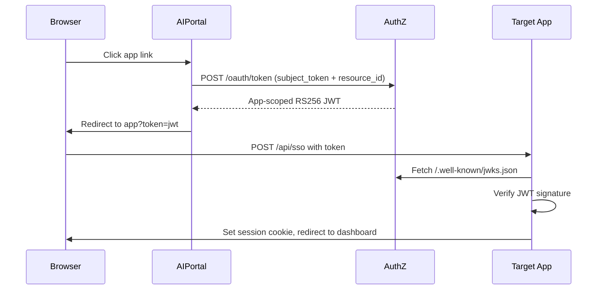
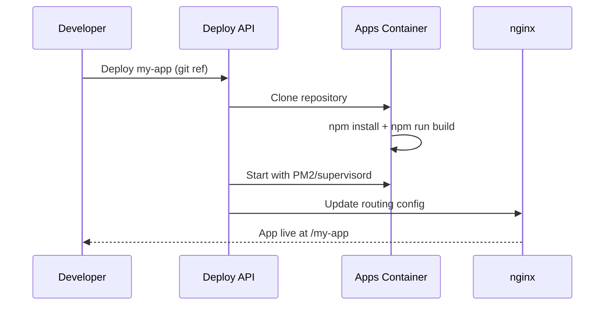

# Applications Layer

**Created**: 2025-12-09  
**Last Updated**: 2026-02-12  
**Status**: Active  
**Category**: Architecture  
**Related Docs**:  
- `architecture/01-containers.md`  
- `architecture/03-authentication.md`  
- `architecture/04-ingestion.md`  
- `architecture/05-search.md`

---

## Service Placement

- **Core Apps Container**: `core-apps-lxc` (CT 201) -- hosts AI Portal, Agent Manager, and other core apps
- **User Apps Container**: `user-apps-lxc` (CT 212) -- hosts user-deployed applications
- **Reverse Proxy**: `proxy-lxc` (CT 200) -- nginx fronts all apps
- **Ports**: Next.js internal `3000`+ ; exposed via proxy `80/443`.
- **Process Management**: supervisord (Docker) or systemd (Proxmox)

---

## Responsibilities

- Provide UI for uploads, search, admin/deployment views.
- Proxy internal calls to:
  - Data API (`/upload`, `/status`, `/files`, `/search`).
  - Search API (`/search`) for retrieval.
  - Agent API (`/chat`, `/agents`) for agent interactions.
  - AuthZ service for token exchange.
- Maintain user sessions and attach JWTs/role claims to backend requests.

---

## App Types

| Type | Description | Authentication |
|------|-------------|----------------|
| **BUILT_IN** | Core portal features (Video, Chat, Document Manager) | Uses session JWT directly |
| **LIBRARY** | Deployed alongside portal (Agent Manager, Doc Intel) | SSO via app-scoped token |
| **EXTERNAL** | User-deployed apps | SSO via app-scoped token |

---

## App Authentication (Zero Trust)

### SSO Flow for External/Library Apps

When a user clicks on an external app (e.g., Agent Manager), ai-portal:

1. Exchanges the user's session JWT for an app-scoped access token via authz
2. AuthZ verifies user has access to the app via RBAC bindings
3. AuthZ issues RS256 token with `app_id` claim and user's roles
4. User is redirected to the app with the token



### App Token Validation

External apps validate tokens using authz JWKS:

```typescript
import * as jose from 'jose';

const AUTHZ_URL = process.env.AUTHZ_BASE_URL || 'http://authz-api:8010';
const APP_NAME = process.env.APP_NAME;

// Create JWKS verifier (cached)
const jwks = jose.createRemoteJWKSet(new URL('/.well-known/jwks.json', AUTHZ_URL));

// Validate incoming token
const { payload } = await jose.jwtVerify(token, jwks, {
  issuer: 'busibox-authz',
  audience: APP_NAME,
});

// Token contains:
// - sub: user UUID
// - roles: user's roles (only those granting app access)
// - scope: aggregated scopes from roles
// - app_id: app UUID (for verification)
```

### App Access Control

App access is controlled via RBAC bindings in authz:

| Role | App Binding | Result |
|------|-------------|--------|
| Admin | Agent Manager | Admin users can access Agent Manager |
| Finance | Agent Manager | Finance users can access Agent Manager |
| Guest | (none) | Guest users cannot access Agent Manager |

Bindings are created via ai-portal admin UI or authz API:

```http
POST /admin/bindings
{
  "role_id": "<role-uuid>",
  "resource_type": "app",
  "resource_id": "<app-uuid>"
}
```

---

## Integration Boundaries

- Apps do **not** expose ingest or search publicly; all backend calls stay on the internal network.
- SSE for ingestion status is proxied: browser connects to app endpoint, which forwards to data API `/status/{fileId}`.
- Role data originates from authz and is included in JWTs passed to backend services.

---

## Deployment Architecture

Apps are deployed at runtime via the Deploy API -- they are NOT baked into container images:



This runtime installation pattern provides:
- **Fast iteration** -- deploy code changes without rebuilding containers
- **Independent updates** -- update one app without affecting others
- **Version control** -- deploy specific git refs, tags, or branches
- **Rollback** -- revert to a previous version instantly

---

## busibox-app Library

The `@jazzmind/busibox-app` library provides shared utilities for all apps:

| Function | Purpose |
|----------|---------|
| `exchangeTokenZeroTrust()` | Exchange session/app token for downstream access token |
| `validateSession()` | Validate session JWT locally or against authz |
| `useAuthzTokenManager()` | Client-side token management hook |
| `IngestClient` | File upload and processing |
| `AgentClient` | AI chat and agents |
| `RBACClient` | Role-based access control |
| `SearchClient` | Document search |
| `SimpleChatInterface` | Drop-in chat UI component |

See `busibox-app/src/lib/authz/zero-trust.ts` for implementation.

---

## Core Apps

| App | Port | Base Path | Description |
|-----|------|-----------|-------------|
| AI Portal | 3000 | / | Main dashboard, admin, document manager |
| Agent Manager | 3001 | /agents | Agent management and chat |
| Status Report | 3003 | /status | Project tracking with AI agents |
| Estimator | 3004 | /estimator | Cost estimation tool |

---

## Deployment Notes

- Deploy core apps: `make install SERVICE=ai-portal` or `make install SERVICE=core-apps`
- Deploy user apps: via Deploy API or AI Portal admin UI
- Environment variables for app endpoints should match container IPs in `provision/pct/vars.env`.
- Keep proxy rules aligned so only apps are internet-facing; backend containers remain internal.
