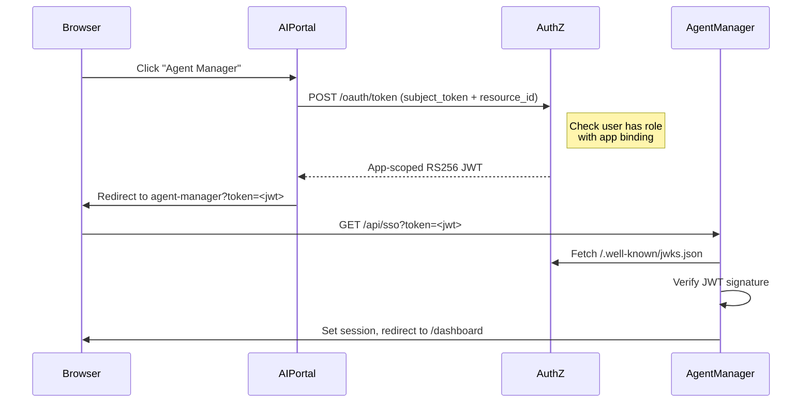

# Applications Layer

**Created**: 2025-12-09  
**Last Updated**: 2026-01-20  
**Status**: Active  
**Category**: Architecture  
**Related Docs**:  
- `architecture/01-containers.md`  
- `architecture/03-authentication.md`  
- `architecture/04-ingestion.md`  
- `architecture/05-search.md`

---

## Service Placement

- **Container**: `apps-lxc` (CT 201)
- **Role**: Hosts user-facing Next.js apps (e.g., AI Portal, Agent Manager) behind `proxy-lxc`.
- **Ports**: Next.js internal `3000`; exposed via proxy `80/443`.

---

## Responsibilities

- Provide UI for uploads, search, admin/deployment views.
- Proxy internal calls to:
  - Ingest API (`/upload`, `/status`, `/files`, `/search`).
  - Search API (`/search`) for retrieval.
  - Agent API (`/chat`, `/agents`) for agent interactions.
  - AuthZ service for token exchange.
- Maintain user sessions and attach JWTs/role claims to backend requests.

---

## App Types

| Type | Description | Authentication |
|------|-------------|----------------|
| **BUILT_IN** | Core portal features (Video, Chat, Document Manager) | Uses session JWT directly |
| **LIBRARY** | Deployed alongside portal (Agent Manager, Doc Intel) | SSO via app-scoped token |
| **EXTERNAL** | Third-party apps (future) | SSO via app-scoped token |

---

## App Authentication (Zero Trust)

### SSO Flow for External/Library Apps

When a user clicks on an external app (e.g., Agent Manager), ai-portal:

1. Exchanges the user's session JWT for an app-scoped access token via authz
2. AuthZ verifies user has access to the app via RBAC bindings
3. AuthZ issues RS256 token with `app_id` claim and user's roles
4. User is redirected to the app with the token



### App Token Validation

External apps validate tokens using authz JWKS:

```typescript
import * as jose from 'jose';

const AUTHZ_URL = process.env.AUTHZ_BASE_URL || 'http://authz-api:8010';
const APP_NAME = 'Agent Manager';

// Create JWKS verifier (cached)
const jwks = jose.createRemoteJWKSet(new URL('/.well-known/jwks.json', AUTHZ_URL));

// Validate incoming token
const { payload } = await jose.jwtVerify(token, jwks, {
  issuer: 'authz-api',
  audience: APP_NAME,
});

// Token contains:
// - sub: user UUID
// - roles: user's roles (only those granting app access)
// - scope: aggregated scopes from roles
// - app_id: app UUID (for verification)
```

### App Access Control

App access is controlled via RBAC bindings in authz:

| Role | App Binding | Result |
|------|-------------|--------|
| Admin | Agent Manager | Admin users can access Agent Manager |
| Finance | Agent Manager | Finance users can access Agent Manager |
| Guest | (none) | Guest users cannot access Agent Manager |

Bindings are created via ai-portal admin UI or authz API:

```http
POST /admin/bindings
{
  "role_id": "<role-uuid>",
  "resource_type": "app",
  "resource_id": "<app-uuid>"
}
```

---

## Integration Boundaries

- Apps do **not** expose ingest or search publicly; all backend calls stay on the internal network.
- SSE for ingestion status is proxied: browser connects to app endpoint, which forwards to ingest `/status/{fileId}`.
- Role data originates from authz and is included in JWTs passed to backend services.

---

## Agent-Manager Integration

**Agent Manager** is a LIBRARY app that provides a UI for managing AI agents.

### Authentication

1. User accesses via ai-portal SSO (app-scoped token)
2. Token is validated via authz JWKS
3. For downstream API calls (agent-api), token is exchanged via authz:

```typescript
import { exchangeTokenZeroTrust } from '@jazzmind/busibox-app';

const result = await exchangeTokenZeroTrust({
  sessionJwt: appToken,  // The app-scoped token from SSO
  audience: 'agent-api',
  scopes: ['agents:read', 'agents:write'],
});

// Use result.accessToken for agent-api calls
```

### Configuration

| Variable | Description |
|----------|-------------|
| `AUTHZ_BASE_URL` | AuthZ service URL (e.g., `http://authz-api:8010`) |
| `APP_NAME` | App name for audience validation (e.g., `Agent Manager`) |
| `AGENT_API_URL` | Agent API URL (e.g., `http://agent-api:8040`) |

---

## Deployment Notes

- Provisioning and deploy automation live under `provision/ansible` (see `make deploy-apps`, `make deploy-ai-portal` in CLAUDE.md).
- Environment variables for app endpoints should match container IPs in `provision/pct/vars.env`.
- Keep proxy rules aligned so only apps are internet-facing; backend containers remain internal.

---

## busibox-app Library

The `@jazzmind/busibox-app` library provides shared authentication utilities:

| Function | Purpose |
|----------|---------|
| `exchangeTokenZeroTrust()` | Exchange session/app token for downstream access token |
| `validateSession()` | Validate session JWT locally or against authz |
| `getUserRoles()` | Get user's role assignments |
| `userCanAccessResource()` | Check if user has access to a resource |

See `busibox-app/src/lib/authz/zero-trust.ts` for implementation.
