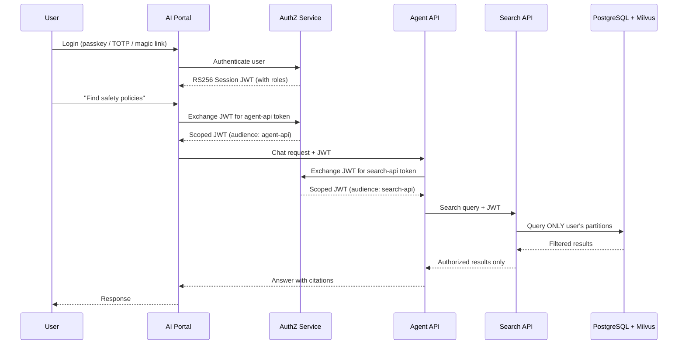
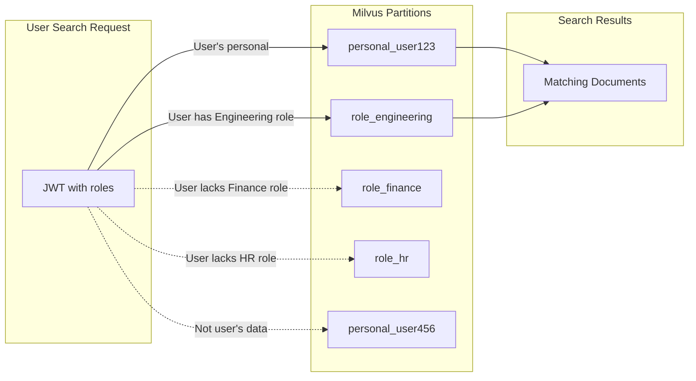

# Security and Privacy

Busibox is built on a Zero Trust security model where every request is authenticated, every data access is authorized, and AI agents inherit the same permissions as the user they serve. There is no backdoor, no admin override, and no way for an LLM to accidentally access data it shouldn't.

## Zero Trust Architecture

In Busibox, nothing is trusted by default:

- **Every API call** carries a cryptographically signed JWT
- **Every service** verifies the token independently via JWKS (no shared secrets)
- **Every data query** is filtered by the user's permissions
- **Every agent** operates within the bounds of the user's roles

## How Authentication Works

### No Static Tokens

Busibox has no static admin tokens, no API keys baked into config files. All authentication uses JWTs:

| Context | How It Works |
|---------|-------------|
| **User login** | Public auth endpoints (passkey, TOTP, magic link) |
| **User operations** | Session JWT exchanged for audience-bound access tokens |
| **Service-to-service** | Service account JWTs via client credentials grant |
| **Background tasks** | User-authorized delegation tokens (scoped and time-limited) |

### Token Exchange

When a user performs an action that requires calling a backend service, the application exchanges their session JWT for a purpose-built access token:

1. User's session JWT is sent to AuthZ as a `subject_token`
2. AuthZ verifies the JWT signature (no database lookup needed)
3. AuthZ issues a new JWT scoped to the target service (e.g., `audience: search-api`)
4. The new JWT contains only the roles and permissions needed for that service
5. The target service validates the token via AuthZ's JWKS endpoint

This means:
- Tokens are **audience-bound** -- a token for the Search API cannot be used with the Agent API
- Tokens are **short-lived** (15 minutes) -- reducing the window for misuse
- Tokens are **cryptographically verified** -- no database lookups for validation

## Row-Level Security (RLS)

PostgreSQL Row-Level Security is the enforcement layer that ensures data isolation:

### How RLS Works in Busibox

1. Every authenticated request sets PostgreSQL session variables from the JWT:
   - `app.user_id` -- the authenticated user
   - `app.user_role_ids` -- the user's role assignments
2. RLS policies on every table check these variables before returning rows
3. Users can only see:
   - Their own personal data
   - Data shared with roles they belong to

### What This Means in Practice

| Scenario | What Happens |
|----------|-------------|
| User A uploads a personal document | Only User A can search or access it |
| User A shares a document with "Engineering" role | All Engineering role members can search it |
| User B (not in Engineering) searches | Document does not appear in results |
| Agent serving User B asks about the document | Agent cannot find it -- same permissions apply |

## Vector Database Partitioning

Milvus vector partitions mirror the RLS model:

When a search executes:
1. The Search API reads the JWT to determine which partitions to query
2. Only `personal_{userId}` and `role_{roleId}` partitions for the user's roles are searched
3. Other partitions are never touched -- data isolation is enforced at the query level

## Agents and Data Boundaries

This is a critical feature: **agents inherit the permissions of the user they serve**.

When an agent performs a document search on behalf of a user:
1. The agent receives the user's JWT (or an exchanged token derived from it)
2. The agent calls the Search API with that token
3. The Search API enforces the same partition restrictions as a direct user search
4. The agent can only synthesize answers from documents the user is authorized to see

There is no "god mode" for agents. An agent cannot:
- Access documents from other users' personal partitions
- Search partitions for roles the user doesn't have
- Bypass RLS policies on metadata queries
- Escalate privileges beyond what the JWT grants

## App Security

Custom applications built on Busibox inherit the security model automatically:

### SSO Integration

When a user launches an app from the portal:
1. AI Portal exchanges the user's session JWT for an app-scoped token
2. AuthZ checks that the user's role has access to the app (via RBAC bindings)
3. The app receives a JWT it can verify via JWKS
4. For downstream calls, the app exchanges the token again for service-specific access

### RBAC for Apps

App access is controlled through role bindings:

| Role | App Access | Result |
|------|-----------|--------|
| Admin | All apps | Full access |
| Engineering | Agent Manager, Doc Intel | Can use those apps |
| Guest | AI Portal only | No access to other apps |

## Encryption

### Data at Rest

- **MinIO** -- objects stored with server-side encryption
- **PostgreSQL** -- sensitive fields use envelope encryption (KEK/DEK pattern)
- **Milvus** -- vectors stored on encrypted volumes

### Data in Transit

- **External** -- TLS via nginx reverse proxy
- **Internal** -- JWT-authenticated calls between services on the private network

### Envelope Encryption

For highly sensitive data (like deployment secrets), Busibox uses envelope encryption:
1. A Key Encryption Key (KEK) is derived from the master key
2. Each piece of data gets a unique Data Encryption Key (DEK)
3. Data is encrypted with the DEK
4. The DEK is encrypted with the KEK and stored alongside the data

## Audit Trail

Every significant action is logged to the audit trail in AuthZ:

- User logins and logouts
- Token exchanges and grants
- Role assignments and changes
- Data access events
- Admin operations

Audit logs include the actor, action, resource, timestamp, and IP address.

## Summary

| Security Layer | Mechanism | Enforcement |
|---------------|-----------|-------------|
| Authentication | RS256 JWTs via AuthZ | Every API call |
| Authorization | RBAC roles + scopes | Token exchange |
| Data isolation | RLS + Milvus partitions | Every query |
| Agent boundaries | Inherited user JWT | Every agent action |
| App access | SSO + role bindings | App launch |
| Secrets | Envelope encryption | At rest |
| Transport | TLS + JWT signatures | In transit |
| Auditing | Structured audit logs | All operations |
