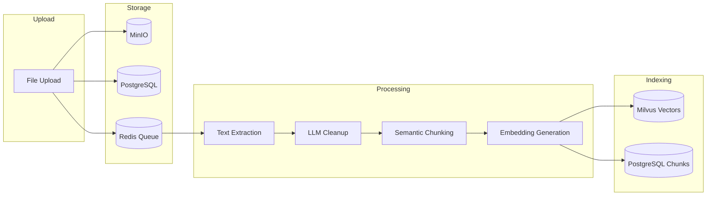

# Document Processing Pipeline

Busibox includes a sophisticated document processing pipeline that transforms uploaded files into searchable, AI-ready content. Multiple extraction strategies, intelligent chunking, and hybrid embeddings ensure high-quality results across document types.

## Pipeline Overview



## Stage 1: Upload and Deduplication

When a file is uploaded:

1. **Content hash** (SHA-256) is computed for deduplication
2. **File is stored** in MinIO at `{userId}/{fileId}/{filename}`
3. **Metadata is recorded** in PostgreSQL:
   - File name, size, MIME type
   - Visibility (personal or shared) and role assignments
   - Processing status
4. **Job is queued** in Redis Streams for async processing

Deduplication ensures the same file isn't processed twice. If a duplicate is detected, the existing processed version is referenced.

## Stage 2: Text Extraction

Busibox supports multiple extraction strategies, choosing the best one based on document type and configuration:

### Extraction Strategies

| Strategy | Best For | How It Works |
|----------|---------|-------------|
| **Simple** | Plain text, HTML, simple PDFs | Direct text extraction using pdfplumber |
| **Marker** | Complex PDFs, academic papers | GPU-accelerated layout analysis with Marker |
| **ColPali** | Scanned documents, images | Vision-language model analyzes page images |

### Automatic Strategy Selection

The pipeline can be configured to:
- **Use a single strategy** for all documents
- **Try multiple strategies** and pick the best result
- **Fall back** from GPU strategies to simpler ones if needed

### PDF Splitting

Large PDFs (more than 5 pages by default) are automatically split into smaller batches for parallel processing. This dramatically speeds up extraction for lengthy documents.

### Supported Formats

- **PDF** -- full support with multiple extraction strategies
- **Word** (.docx, .doc) -- text and table extraction
- **Excel** (.xlsx, .xls) -- spreadsheet to text conversion
- **PowerPoint** (.pptx) -- slide text extraction
- **Images** (.png, .jpg, .tiff) -- OCR and ColPali vision
- **HTML** -- clean text extraction
- **Markdown** -- direct pass-through
- **Plain text** -- direct pass-through

## Stage 3: LLM Cleanup (Optional)

When enabled (`LLM_CLEANUP_ENABLED`), extracted text is passed through an LLM to:

- Fix OCR artifacts and encoding errors
- Normalize formatting inconsistencies
- Remove headers, footers, and page numbers
- Clean up table formatting

This step uses the LiteLLM gateway, so it can run on a local model (for privacy and cost) or a cloud model (for quality).

## Stage 4: Semantic Chunking

Text is split into chunks optimized for retrieval:

- **Target size**: 400-800 tokens (configurable via `CHUNK_SIZE_MIN`, `CHUNK_SIZE_MAX`)
- **Overlap**: ~12% between chunks (configurable via `CHUNK_OVERLAP_PCT`)
- **Semantic boundaries**: Chunks break at paragraph and section boundaries when possible
- **Metadata preserved**: Each chunk retains its source file, page number, and position

Good chunking is critical for search quality -- chunks that are too small lose context, chunks that are too large dilute relevance.

## Stage 5: Embedding Generation

Each chunk is converted into vector representations for search:

### Dense Embeddings (Text)

- **Model**: FastEmbed with `BAAI/bge-large-en-v1.5` (1024 dimensions)
- **Purpose**: Capture semantic meaning for similarity search
- **Batch processing**: Configurable batch size for throughput optimization

### Sparse Embeddings (BM25)

- **Purpose**: Traditional keyword matching signals
- **Benefit**: Catches exact term matches that semantic search might miss

### Visual Embeddings (Optional)

- **Model**: ColPali on vLLM
- **Purpose**: Capture visual layout information from document pages
- **Use case**: Tables, charts, forms -- content where layout matters

The combination of dense, sparse, and visual embeddings enables **hybrid search** that outperforms any single approach.

## Stage 6: Indexing

Processed embeddings are stored in Milvus with security-aware partitioning:

- **Personal documents** go to `personal_{userId}` partition
- **Shared documents** go to `role_{roleId}` partition(s)
- **Metadata** is stored in PostgreSQL for enriching search results

## Processing Status Tracking

The pipeline provides real-time status via Server-Sent Events (SSE):

```
queued → parsing → chunking → embedding → indexing → completed
```

Applications can subscribe to status updates and show progress to users. If any stage fails, the status reflects the error with diagnostic information.

## Processing Configuration

| Variable | Default | Purpose |
|----------|---------|---------|
| `CHUNK_SIZE_MIN` | 400 | Minimum chunk size in tokens |
| `CHUNK_SIZE_MAX` | 800 | Maximum chunk size in tokens |
| `CHUNK_OVERLAP_PCT` | 12 | Overlap between chunks (%) |
| `EMBEDDING_BATCH_SIZE` | 32 | Batch size for embedding generation |
| `LLM_CLEANUP_ENABLED` | false | Enable LLM text cleanup |
| `COLPALI_ENABLED` | false | Enable visual embeddings |
| `FASTEMBED_MODEL` | BAAI/bge-large-en-v1.5 | Text embedding model |

## Building Document-Driven Pipelines

The processing pipeline is designed to be composed into larger workflows:

### Example: Automated Document Analysis

1. **Upload** contracts, reports, or compliance documents
2. **Processing** extracts and indexes all content automatically
3. **Agent** with document search tool can answer questions across the corpus
4. **Application** presents a focused UI for the specific use case

### Example: Knowledge Base

1. **Bulk upload** documentation, manuals, and guides
2. **Search API** powers a knowledge base search interface
3. **Chat agent** provides conversational access to the knowledge base
4. **Access control** ensures different teams see different content

### Example: Data Room

1. **Upload** financial documents, legal filings, due diligence materials
2. **Personal visibility** keeps each reviewer's uploads private
3. **Shared visibility** makes common documents available to all reviewers
4. **Audit trail** tracks who accessed what and when

The same infrastructure handles all of these patterns -- you just configure the visibility model and build the UI.
