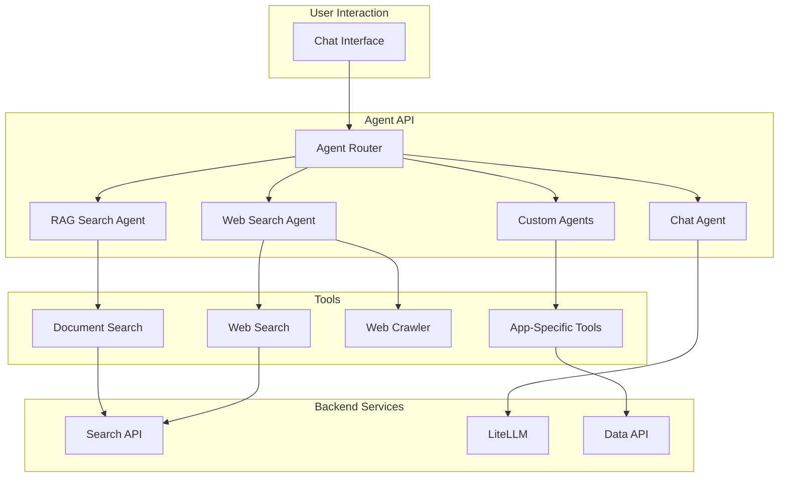

# Agent Tools and Capabilities

Busibox agents are more than chatbots -- they're orchestrators that can search your documents, browse the web, and execute custom tools. Each agent can be configured with different models, tools, and behaviors to match your use case.

## Agent Architecture



## Built-in Tools

### Document Search (RAG)

The core tool that enables grounded AI responses:

- **What it does**: Searches your indexed documents using hybrid search (semantic + keyword)
- **How it works**: The agent formulates a search query from the user's question, calls the Search API, and uses the results as context for generating an answer
- **Security**: Uses the user's JWT, so results are limited to authorized documents
- **Citations**: Results include source references that link back to original documents

### Web Search

Extend your agents beyond your document corpus:

- **What it does**: Searches the web for real-time information
- **Providers**: Configurable search providers (Tavily, SerpAPI, Perplexity, Bing)
- **Use case**: Questions about current events, external references, or topics not in your documents

### Web Crawler

Fetch and process content from specific URLs:

- **What it does**: Retrieves content from web pages and extracts readable text
- **Use case**: Analyzing competitor pages, monitoring news, ingesting web content
- **Integration**: Crawled content can be fed into the document processing pipeline

## How Agents Work

### Streaming Chat

Agents use Server-Sent Events (SSE) for real-time streaming responses:

1. User sends a message with optional toggles (enable doc search, enable web search)
2. Agent decides which tools to invoke based on the query and configuration
3. Tools execute and return context
4. Agent synthesizes a response using the LLM, streaming tokens as they're generated
5. Citations and debug information are included in the response

### Intelligent Routing

The agent system routes requests through specialized sub-agents:

| Agent | Purpose | Tools |
|-------|---------|-------|
| **RAG Search Agent** | Grounded document answers | Document search |
| **Web Search Agent** | External information | Web search, crawling |
| **Chat Agent** | General conversation | None (direct LLM) |
| **Attachment Agent** | File analysis | File access, document search |

The router examines the user's message and context to select the appropriate agent(s), combining results when multiple sources are needed.

### Model Selection Per Agent

Each agent can be configured with a different model:

- **RAG agent**: Use a capable model for synthesis (e.g., GPT-4o)
- **Simple Q&A**: Use a fast local model (e.g., Llama via vLLM)
- **Code generation**: Use a specialized model (e.g., Claude)

Models are configured at the agent level and routed through the LiteLLM gateway.

## Custom Agents

Beyond the built-in agents, you can create custom agents tailored to specific workflows:

### Agent Definitions

Agents are defined with:
- **Name and description** -- what the agent does
- **System prompt** -- instructions that guide the agent's behavior
- **Model** -- which LLM to use
- **Tools** -- which tools the agent has access to
- **Configuration** -- temperature, max tokens, and other parameters

### Application-Specific Agents

Custom apps can define agents specific to their domain. For example:

- A **status report agent** that knows about projects and tasks
- A **bid analysis agent** that can compare proposal documents
- A **compliance agent** that checks documents against regulatory requirements

These agents use the same infrastructure (search, LLM, security) but with domain-specific prompts and tools.

## Conversations and Context

### Conversation Management

- **Persistent conversations** -- chat history is stored and can be resumed
- **Context window management** -- long conversations are managed to fit model limits
- **Multi-turn reasoning** -- agents maintain context across turns

### Attachment Support

Users can attach files directly to conversations:

1. File is uploaded through the data pipeline
2. Agent receives attachment metadata
3. Agent can search the attached document's content
4. Responses reference the specific attachment

## Agent API

The Agent API provides a programmable interface:

| Endpoint | Purpose |
|----------|---------|
| `POST /api/chat` | Stream a chat response |
| `GET /api/agents` | List available agents |
| `GET /api/conversations` | List conversations |
| `POST /api/runs` | Execute agent workflows |
| `GET /api/tools` | List available tools |

### Example Chat Request

```json
{
  "message": "What are the key risks in the Q4 report?",
  "agentId": "rag-search-agent",
  "enableDocumentSearch": true,
  "enableWebSearch": false,
  "conversationId": "existing-conversation-id"
}
```

The response streams via SSE with:
- Token-by-token text generation
- Source citations from document search
- Debug information (which tools were called, what context was used)

## Extending Agents

### Adding New Tools

Tools are functions that agents can invoke. To add a new tool:

1. Define the tool's schema (inputs, outputs, description)
2. Implement the tool logic
3. Register the tool with the agent system
4. Configure which agents have access to the tool

### Workflow Orchestration

For complex multi-step processes, agents support workflows:

- **Sequential steps** -- do A, then B, then C
- **Conditional logic** -- if A returns X, do B; otherwise do C
- **Parallel execution** -- run multiple tools simultaneously
- **Human in the loop** -- pause for user confirmation at key steps

Workflows are managed through the Agent Manager interface or via API.
