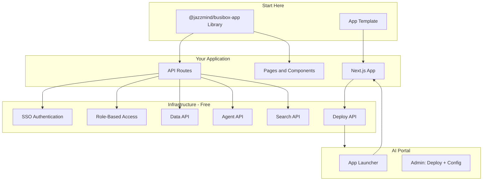
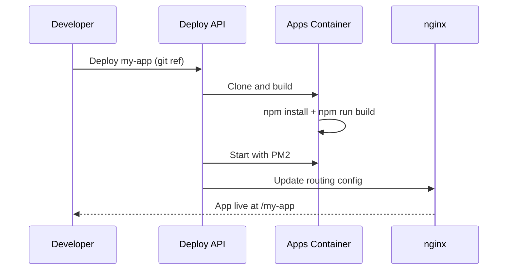

# Building Apps on Busibox

Busibox includes an app template and shared library that let you rapidly build Next.js applications. Deploy your app to the portal and it immediately gets SSO authentication, role-based access control, document storage, AI agents, and semantic search -- without writing a single line of infrastructure code.

## The App Ecosystem



## Getting Started

### 1. Clone the Template

The app template provides a pre-configured Next.js 16 project with everything wired up:

```bash
git clone <app-template-repo> my-app
cd my-app
npm install
```

The template includes:
- Next.js 16 with App Router and Turbopack
- TypeScript, Tailwind CSS 4, React 19
- SSO authentication pre-configured
- Auth middleware for API routes
- Health check endpoint
- Dark/light theme support
- Example pages and components

### 2. Choose Your Mode

The template supports two operational modes:

| Mode | When to Use | Data Access |
|------|------------|-------------|
| **Frontend** (`APP_MODE=frontend`) | Your app proxies to backend services | Via Data API, Agent API, etc. |
| **Prisma** (`APP_MODE=prisma`) | Your app needs its own database | Direct PostgreSQL via Prisma ORM |

Most apps should use **frontend mode** -- it's simpler and leverages the existing data infrastructure.

### 3. Build Your Features

Add pages, components, and API routes:

```typescript
// app/api/my-feature/route.ts
import { requireAuthWithTokenExchange } from '@/lib/auth-middleware';

export async function GET(request: NextRequest) {
  // Authentication is handled for you
  const auth = await requireAuthWithTokenExchange(request, 'data-api');
  if (auth instanceof NextResponse) return auth;

  // Call backend services with the user's token
  const response = await fetch(`${DATA_API_URL}/data`, {
    headers: { 'Authorization': `Bearer ${auth.apiToken}` },
  });

  return NextResponse.json(await response.json());
}
```

### 4. Deploy to the Portal

Push your code and deploy via the admin interface or make commands:

```bash
make install SERVICE=my-app
```

Your app appears in the AI Portal's app launcher, accessible to users with the appropriate roles.

## The `@jazzmind/busibox-app` Library

The shared library provides typed clients and components for every Busibox service:

### Service Clients

```typescript
import {
  IngestClient,    // File upload and processing
  AgentClient,     // AI chat and agents
  RBACClient,      // Role-based access control
  AuditClient,     // Audit logging
  SearchClient,    // Document search
  EmbeddingsClient // Vector embeddings
} from '@jazzmind/busibox-app';
```

### React Components

```typescript
import {
  Header,              // App header with navigation
  Footer,              // Standard footer
  ThemeToggle,         // Dark/light mode toggle
  ChatInterface,       // Full chat UI with streaming
  DocumentViewer,      // Document display
  SimpleChatInterface, // Lightweight chat widget
} from '@jazzmind/busibox-app';
```

### Context Providers

```typescript
import {
  ThemeProvider,          // Dark/light mode
  CustomizationProvider,  // Branding and customization
  BusiboxApiProvider,     // API configuration
} from '@jazzmind/busibox-app';
```

### Authentication Helpers

```typescript
import {
  exchangeTokenZeroTrust,  // Token exchange for service calls
  validateSession,          // Validate session JWT
  useAuthzTokenManager,     // Client-side token management
} from '@jazzmind/busibox-app';
```

## What You Get for Free

When you deploy an app on Busibox, these features are available without any additional work:

### Authentication (SSO)

- Users authenticate once through the AI Portal
- Your app receives a verified JWT when users navigate to it
- No login page, no password management, no session handling

### Authorization (RBAC)

- Control which roles can access your app through the admin UI
- Access the user's roles in your API routes
- Enforce fine-grained permissions using the RBAC client

### Document Storage and Search

- Upload files through the Data API (they go through the full processing pipeline)
- Search documents with the Search API (hybrid semantic + keyword search)
- All data respects the user's permissions automatically

### AI Agents

- Invoke the chat API with a few lines of code
- Use the `SimpleChatInterface` component for instant chat UI
- Create custom agents specific to your app's domain

### Data Storage

- Store structured data through the Data API
- Data is associated with users and organizations
- No need to set up your own database (unless you choose Prisma mode)

## Example Apps

### Status Report

A project tracking app that uses AI agents for intelligent status updates:
- Stores projects and tasks via Data API
- Custom agents guide users through status updates
- Agent can answer questions about project history

### Bid Finder

A procurement tool that analyzes bid documents:
- Uploads RFPs through the document pipeline
- Search agent compares requirements across bids
- Custom UI for bid analysis workflow

### Estimator

A cost estimation tool with its own database:
- Uses Prisma mode for structured estimate data
- Leverages AI for cost predictions
- Document upload for reference materials

## Deployment Architecture

Apps are deployed via the Deploy API:

1. **Build**: Next.js app is built on the target container
2. **Process management**: PM2 or supervisord manages the process
3. **Routing**: nginx proxies requests to your app at its configured base path
4. **Updates**: Push code and redeploy -- no container rebuild needed



### Runtime Installation

Apps are installed at runtime, not baked into container images. This means:
- **Fast iteration** -- deploy code changes without rebuilding containers
- **Independent updates** -- update one app without affecting others
- **Version control** -- deploy specific git refs, tags, or branches
- **Rollback** -- revert to a previous version instantly

## Environment Variables

Your app needs minimal configuration:

```bash
# Required
PORT=3002
NEXT_PUBLIC_BASE_PATH=/my-app
NEXT_PUBLIC_AI_PORTAL_URL=http://portal-url
AUTHZ_BASE_URL=http://authz:8010
AUTHZ_CLIENT_ID=my-app
AUTHZ_CLIENT_SECRET=<from-vault>
APP_NAME=My App

# Optional (for service access)
DATA_API_URL=http://data-api:8002
AGENT_API_URL=http://agent-api:8000
SEARCH_API_URL=http://search-api:8003
```

Environment variables and secrets are managed through the deployment system -- no `.env` files committed to git.

## Best Practices

1. **Use frontend mode** unless you truly need your own database
2. **Leverage the library** -- don't rebuild auth, chat, or document handling
3. **Respect the security model** -- always use `requireAuthWithTokenExchange` for API routes
4. **Keep it focused** -- build domain-specific features, let the platform handle infrastructure
5. **Test locally** -- the template supports local development against staging services
