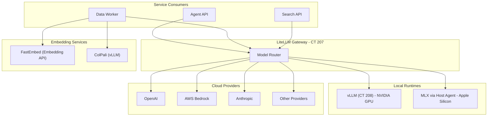

# AI & LLM Stack

**Created**: 2025-12-09  
**Last Updated**: 2026-02-12  
**Status**: Active  
**Category**: Architecture  
**Related Docs**:  
- `architecture/01-containers.md`  
- `architecture/04-ingestion.md`  
- `architecture/05-search.md`  
- `architecture/06-agents.md`

## Architecture Overview

## LLM Gateway (liteLLM)
- **Location**: `litellm-lxc` (CT 207)
- **Port**: `4000`
- **Role**: Single entry point for model inference and reranking. Supports local vLLM/MLX and remote providers via OpenAI-compatible API.
- **Consumers**: Data worker (LLM cleanup), Search service (reranker), Agent API.

## Local Model Runtimes
- **vLLM** (`vllm-lxc`, CT 208): Primary local inference runtime; GPU-capable. Supports quantized models (GPTQ, AWQ) and continuous batching.
- **MLX** (Host Agent): For Apple Silicon Macs, MLX provides native Metal GPU acceleration. Requires a host-agent bridge (`host-agent` on port 8089) since MLX needs direct hardware access not available inside containers.
- Selection is handled through liteLLM routing/config, not by callers directly.

## Embeddings
- **Text embeddings**: FastEmbed (default `BAAI/bge-large-en-v1.5`, 1024-d). Runs as a dedicated Embedding API service on the data container; batch size configurable via `EMBEDDING_BATCH_SIZE`.
- **Visual embeddings**: Optional ColPali (`COLPALI_BASE_URL`, defaults to `http://colpali:9006/v1`). Enabled via `COLPALI_ENABLED`.
- **Hybrid features**: Ingest computes dense vectors + BM25 terms; Search can combine semantic and sparse signals.

## Reranking
- Search service can rerank via liteLLM using `RERANKER_MODEL` (default `reranking`). Config toggles `ENABLE_RERANKING`.

## Pipeline Touchpoints
- **Ingestion**:
  - Upload -> dedupe by SHA-256 -> enqueue Redis job.
  - Worker extracts text (Marker/TATR/OCR fallbacks), chunks (400-800 tokens, ~12% overlap), embeds with FastEmbed; optional ColPali for visuals.
  - Stores vectors in Milvus with partitions keyed to user/role visibility.
- **Search**:
  - JWT -> partition list (personal + role partitions).
  - Milvus search (semantic or hybrid); optional rerank; highlights and alignment features available.
- **Agents**:
  - Agent API calls Search for retrieval and liteLLM for synthesis.
  - Token exchange ensures agents inherit the user's data permissions.

## Agent Chat Orchestration
- **Endpoint**: Agent API `POST /api/chat` (streaming; prepends `<!-- ROUTING_DEBUG:... -->` for UI debug).
- **Flow**: accepts user prompt + toggles (web/doc) + attachments -> attachment decision (heuristic) -> document search (uses Search API) -> chat response via liteLLM.
- **Auth**: RS256 JWTs from AuthZ service (`iss=busibox-authz`, `aud=agent-api`). Token exchange via AuthZ to call downstream services (Search API, Data API) on behalf of the user.
- **Tools**: document-search (grounded RAG), web-search (configurable provider), web-crawler.
- **Models**: uses liteLLM models (`AGENT_SERVER_DEFAULT_MODEL` fallback). Per-agent model selection supported.

## Configuration Highlights
- **liteLLM**: `LITELLM_BASE_URL`, `LITELLM_API_KEY`
- **Embeddings**: `FASTEMBED_MODEL`, `EMBEDDING_BATCH_SIZE`
- **Visual**: `COLPALI_BASE_URL`, `COLPALI_ENABLED`
- **Chunking**: `CHUNK_SIZE_MIN`, `CHUNK_SIZE_MAX`, `CHUNK_OVERLAP_PCT`
- **Cleanup**: `LLM_CLEANUP_ENABLED` (data worker LLM-based text cleanup)

See `srv/data/src/shared/config.py` and `srv/search/src/shared/config.py` for authoritative variable names and defaults.

## GPU Burst Windows (Optional)

For Kubernetes/Rackspace Spot deployments, Busibox supports dynamic GPU provisioning:

- **Pattern**: Provision GPU node on demand → run vLLM during burst window → deprovision to minimize cost
- **LiteLLM routing**: Model `gpu-agent` routes to local vLLM when available (latency-based), falls back to cloud (e.g., OpenAI) when GPU is down
- **Commands**: `make k8s-gpu-up`, `make k8s-gpu-down`, `make k8s-gpu-status`, `make k8s-gpu-window MINUTES=60`
- **Files**: `k8s/terraform/main.tf`, `k8s/base/llm/vllm-gpu.yaml`, `scripts/k8s/gpu-burst.sh`

Tainted GPU nodes ensure only vLLM pods schedule on GPU; base workloads stay on the base node.
