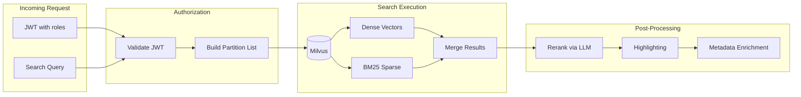

# Search Service

**Created**: 2025-12-09  
**Last Updated**: 2026-02-12  
**Status**: Active  
**Category**: Architecture  
**Related Docs**:  
- `architecture/01-containers.md`  
- `architecture/02-ai.md`  
- `architecture/03-authentication.md`  
- `architecture/04-ingestion.md`

## Service Placement
- **Container**: `milvus-lxc` (CT 204) hosts Milvus; Search API runs alongside it.
- **Code**: `srv/search`
- **Port**: `8003` (FastAPI)
- **Exposure**: Internal; apps call through proxy.

## Search Flow

## Responsibilities
- Hybrid retrieval across Milvus vectors (semantic/ColPali) and BM25 signals.
- Partition-aware access control aligned to ingest visibility (personal and role partitions).
- Optional reranking via liteLLM.
- Highlighting and semantic alignment helpers.

## Auth & Partitions
- JWT middleware validates RS256 tokens from AuthZ service (audience `search-api`, issuer `busibox-authz`).
- Builds accessible partitions per request based on JWT `roles` claim:
  - Personal: `personal_{userId}`
  - Shared: `role_{roleId}` for each readable role
- **Note**: OAuth2 scope-based operation authorization (e.g., `search.read`) is designed but not yet enforced. See `architecture/03-authentication.md` for current status.
- Legacy `x-user-id` supported only for migration.

## Key Endpoint
- `POST /search` — main hybrid search; see [services/search/](../services/search/01-overview.md) for full API reference.
- `GET /health` — service readiness.

## Dependencies
- **Milvus**: Host/collection configured via `MILVUS_HOST`, `MILVUS_COLLECTION`.
- **PostgreSQL**: Metadata/role awareness via `POSTGRES_*` config.
- **liteLLM**: Reranking (`LITELLM_BASE_URL`, `RERANKER_MODEL`, `ENABLE_RERANKING`).
- **Embedding service**: Optional fallback to embedding endpoint `EMBEDDING_SERVICE_URL` when needed.

## Configuration Highlights (see `shared/config.py`)
- `SERVICE_PORT` (default 8003), `LOG_LEVEL`
- `DEFAULT_SEARCH_LIMIT`, `MAX_SEARCH_LIMIT`
- `ENABLE_RERANKING`, `RERANKER_MODEL`
- Highlighting: `HIGHLIGHT_FRAGMENT_SIZE`, `HIGHLIGHT_NUM_FRAGMENTS`
- Caching: `ENABLE_CACHING`, `CACHE_TTL`

## Notes vs Prior Docs
- Search is a dedicated service; agent-lxc should call this API rather than embedding search logic.
- Authorization is enforced through Milvus partition selection derived from JWT roles, not via ingest webhook paths described in older documents.
- Search API runs on the same container as Milvus (CT 204) for low-latency vector queries.