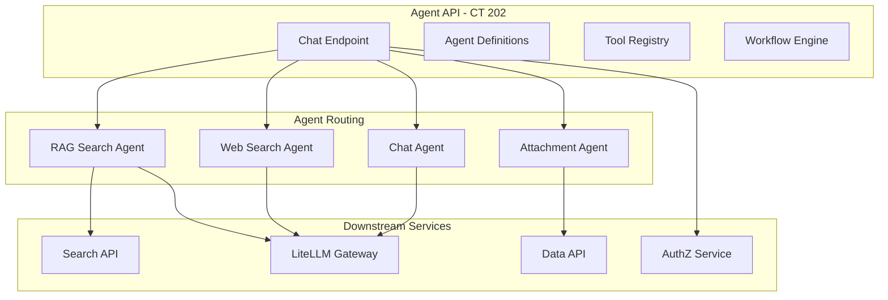

# Agent Service

**Created**: 2025-12-09  
**Last Updated**: 2026-02-12  
**Status**: Active  
**Category**: Architecture  
**Related Docs**:  
- `architecture/00-overview.md`  
- `architecture/02-ai.md`  
- `architecture/05-search.md`

## Service Placement
- **Container**: `agent-lxc` (CT 202)
- **Code**: `srv/agent`
- **Port**: 8000 (FastAPI)
- **Exposure**: Internal-only
- **Additional**: Docs API also runs on this container (port 8004)

## Agent Architecture



## Responsibilities
- Orchestrate agent-style requests (RAG + web + attachment decisions):
  - Accept user prompt, toggles (web/doc), attachments metadata.
  - Call Search API for retrieval (document-search tool).
  - Call liteLLM via OpenAI-compatible API for synthesis.
  - Enforce RBAC using the same JWT/role model as apps/search/ingest.
- Provide a stable surface for apps to invoke AI workflows without duplicating search/LLM calls.
- Manage agent definitions, conversations, workflows, and tools.

## Auth
- End-user JWT: RS256 tokens from AuthZ service (`iss=busibox-authz`, `aud=agent-api`).
- Token validation via JWKS from AuthZ service (`AUTHZ_JWKS_URL`).
- Token exchange: Agent service exchanges user tokens for service-specific tokens (e.g., `search-api`, `data-api`) via AuthZ token-exchange grant to call downstream services on behalf of the user.
- Scopes from JWT are stored in token grants for downstream calls.
- **Note**: OAuth2 scope-based operation authorization (e.g., `agent.execute`) is designed but not yet enforced. See `architecture/03-authentication.md` for current status.

## Built-in Agents (listed via `/admin/agents`)
- `rag-search-agent`: uses `document-search` tool; grounded answers with citations.
- `web-search-agent`: web search with configurable provider.
- `attachment-agent`: heuristic action/modelHint for attachments.
- `chat-agent`: final responder; uses provided doc/web/attachment context, avoids fabrication.

## Chat Endpoint
- **Path**: `POST /chat/message` (streaming: `POST /chat/message/stream`)
- **Behavior**: attachment decision -> optional doc search -> chat synthesis via liteLLM; streams tokens via SSE.
- **Inputs**: `content`, `enableDocumentSearch`, `enableWebSearch`, `attachmentIds?`, `model?`, `conversationId?`
- **Outputs**: streaming text + routing debug; doc results included in debug payload for UI display.

## Additional APIs (no `/api` prefix)
- `GET /agents` — list available agents
- `GET /conversations` — list conversations
- `POST /runs` — execute agent workflows
- `POST /runs/invoke` — synchronous agent invocation with optional structured output
- `GET /agents/tools` — list available tools
- `GET /admin/agents` — admin view of agent definitions

**Detailed docs**: [services/agents/](../services/agents/01-overview.md)

## Structured Output via `/runs/invoke`

For programmatic tasks that need deterministic JSON output (scoring, classification, summarization, data transformation), use the `/runs/invoke` endpoint with `response_schema`. This bypasses the chat system entirely and forces the LLM to produce schema-conforming JSON with validation and retry.

### How It Works

1. App calls `POST /runs/invoke` with `agent_name`, `input.prompt`, and `response_schema`
2. The agent runs with tools disabled and structured output enforced
3. The agent sends `response_format: { type: "json_schema", json_schema: <schema> }` to the LLM via LiteLLM
4. Response is validated against the schema with `jsonschema.validate()`; retries once on validation failure
5. The validated JSON is returned in `output`

### Schema Format

The `response_schema` follows the OpenAI structured output format:

```json
{
  "name": "my_output",
  "strict": true,
  "schema": {
    "type": "object",
    "additionalProperties": false,
    "required": ["items"],
    "properties": {
      "items": {
        "type": "array",
        "maxItems": 10,
        "items": {
          "type": "object",
          "additionalProperties": false,
          "properties": {
            "name": { "type": "string" },
            "score": { "type": "number" }
          },
          "required": ["name", "score"]
        }
      }
    }
  }
}
```

Key fields:
- `name` — identifier for logging (required)
- `strict` — enables strict schema enforcement (recommended)
- `schema` — the actual JSON Schema describing the output

### Which Agent to Use

Use the built-in `record-extractor` agent. It is a no-tool, deterministic agent designed for structured output tasks. It automatically:
- Prepends `/no_think` to suppress Qwen reasoning blocks
- Validates output against your schema
- Retries once on validation failure
- Extracts JSON from markdown fences or thinking blocks if needed

### Example: App API Route (TypeScript)

```typescript
const AGENT_API_URL = process.env.AGENT_API_URL || "http://localhost:8000";

const SCORE_SCHEMA = {
  name: "candidate_scores",
  strict: true,
  schema: {
    type: "object",
    additionalProperties: false,
    required: ["scores"],
    properties: {
      scores: {
        type: "array",
        maxItems: 10,
        items: {
          type: "object",
          additionalProperties: false,
          required: ["criterionId", "score", "reasoning"],
          properties: {
            criterionId: { type: "string" },
            score: { type: "number" },
            reasoning: { type: "string" },
          },
        },
      },
    },
  },
};

// Call from a Next.js API route
const res = await fetch(`${AGENT_API_URL}/runs/invoke`, {
  method: "POST",
  headers: {
    Authorization: `Bearer ${agentApiToken}`,
    "Content-Type": "application/json",
  },
  body: JSON.stringify({
    agent_name: "record-extractor",
    input: {
      prompt: `Score this candidate against the criteria:\n\n${candidateProfile}`,
    },
    response_schema: SCORE_SCHEMA,
    agent_tier: "complex",
  }),
});

const { output, error } = await res.json();
// output is validated JSON matching SCORE_SCHEMA.schema
```

### Agent Tiers

- `simple` — 30s timeout, 512MB memory (default)
- `complex` — 5min timeout, 2GB memory (use for longer prompts)
- `batch` — 30min timeout, 4GB memory (use for large batch processing)

### Common Mistakes

- **Do NOT use `/llm/completions`** for structured output — it's a raw LiteLLM passthrough with no schema enforcement, validation, or retry
- **Do NOT use `/chat/message`** for programmatic tasks — it has a 1000-char query limit and is designed for conversational interaction
- **Always include `additionalProperties: false`** in object schemas — without this, the LLM may add unexpected fields
- **Always include `required` arrays** — omitting them means the LLM can skip fields
- **Use `maxItems` on arrays** — prevents the LLM from generating unbounded lists

## Guardrails and Cost Controls

Workflows and agents operate under configurable guardrails that prevent runaway execution and enforce cost ceilings. The workflow engine tracks usage in real-time and raises `GuardrailsExceededError` when any limit is hit, halting execution cleanly.

### Available Guardrails

| Guardrail | What It Controls | Example |
|-----------|-----------------|---------|
| `request_limit` | Maximum number of LLM requests across all steps | `200` |
| `total_tokens_limit` | Maximum total tokens (input + output) across all requests | `200000` |
| `tool_calls_limit` | Maximum number of tool invocations | `500` |
| `max_cost_dollars` | Hard cost ceiling in USD based on model pricing | `10.0` |
| `timeout_seconds` | Maximum wall-clock execution time | `600` |

### How It Works

Guardrails are defined per workflow definition and stored in the `guardrails` column of the workflow table. The workflow engine (`UsageLimits` class in `srv/agent/app/workflows/engine.py`) initializes counters from the guardrails configuration and checks limits before each LLM call or tool invocation.

```json
{
  "name": "data-collection-workflow",
  "steps": [ ... ],
  "guardrails": {
    "request_limit": 200,
    "tool_calls_limit": 500,
    "total_tokens_limit": 200000,
    "max_cost_dollars": 10.0,
    "timeout_seconds": 600
  }
}
```

When a limit is exceeded, the engine stops execution and records the reason in the run output. Workflows can also override default guardrails at creation time for specific runs.

### Agent Tiers as Guardrails

The agent tier system (`simple`, `complex`, `batch`) also acts as a guardrail layer, setting timeout and memory boundaries:

- `simple` -- 30s timeout, 512MB memory (default for quick tasks)
- `complex` -- 5min timeout, 2GB memory (multi-step reasoning)
- `batch` -- 30min timeout, 4GB memory (large data processing)

### Implementation

- **Domain model**: `guardrails` field on `WorkflowDefinition` (`srv/agent/app/models/domain.py`)
- **Schema**: `guardrails` in `WorkflowCreate` / `WorkflowUpdate` (`srv/agent/app/schemas/definitions.py`)
- **Engine**: `UsageLimits` class and `GuardrailsExceededError` (`srv/agent/app/workflows/engine.py`)

## Custom Agents

Apps can register custom agents via `POST /agents/definitions`. Custom agents are useful when you need specific system instructions or tool configurations.

```typescript
// Agent definition (e.g., in lib/my-agents.ts)
export const MY_AGENT = {
  name: "my-scoring-agent",
  display_name: "Scoring Agent",
  description: "Scores items against criteria",
  instructions: `You are an expert evaluator. When given items and criteria,
score each item objectively based on evidence provided.`,
  model: "agent",
  tools: { names: [] },
  workflows: { execution_mode: "run_once" },
};

// Seed via API (one-time setup)
await fetch(`${AGENT_API_URL}/agents/definitions`, {
  method: "POST",
  headers: {
    Authorization: `Bearer ${token}`,
    "Content-Type": "application/json",
  },
  body: JSON.stringify(MY_AGENT),
});

// Then invoke with structured output
await fetch(`${AGENT_API_URL}/runs/invoke`, {
  method: "POST",
  headers: { Authorization: `Bearer ${token}`, "Content-Type": "application/json" },
  body: JSON.stringify({
    agent_name: "my-scoring-agent",
    input: { prompt: "Score these candidates..." },
    response_schema: MY_SCHEMA,
    agent_tier: "complex",
  }),
});
```

## Building App Agents (Step-by-Step)

This section explains how any Busibox app can add an AI agent without modifying the core agent service.

### Core Principle: Generic Tools + Domain Prompts

The agent service provides a registry of **generic, app-agnostic tools** (e.g., `query_data`, `aggregate_data`, `get_facets`, `document_search`). Apps customize behavior entirely through:

1. **Agent instructions** (system prompt) -- teaches the LLM field names, query patterns, and document structure
2. **Runtime metadata** -- provides document IDs and current filter state at chat time
3. **Tool selection** -- chooses which core tools the agent can use

No custom tool code is needed in the agent service.

### Step 1: Define Agent (`lib/*-agents.ts`)

Create an agent definition with tool names (from the core registry) and detailed instructions:

```typescript
// lib/my-agents.ts
export const MY_APP_AGENT = {
  name: "my-app-assistant",
  display_name: "My App Assistant",
  description: "Helps users analyze and manage data in My App",
  instructions: `You are a helpful assistant for My App.

## Context
The app metadata contains:
- **notesDocumentId**: Data document ID for notes records.

## Data Schema (notesDocumentId)
Field names for query_data where clauses:
- \`title\`: Note title (string)
- \`content\`: Note body (string)
- \`category\`: e.g., "work", "personal", "ideas"
- \`priority\`: 1-5 (integer)
- \`createdAt\`: ISO date string
- \`updatedAt\`: ISO date string

## How to Answer Questions
- To find notes: use **query_data** with notesDocumentId and where clauses
- To get category breakdown: use **aggregate_data** with group_by=["category"]
- To discover categories: use **get_facets** with fields=["category", "priority"]
- For semantic search: use **document_search**
`,
  model: "agent",
  tools: {
    names: ["query_data", "aggregate_data", "get_facets", "document_search"],
  },
  workflows: {
    execution_mode: "run_max_iterations",
    tool_strategy: "llm_driven",
    max_iterations: 10,
  },
  allow_frontier_fallback: true,
  is_builtin: false,
  scopes: ["data:read", "search:read"],
};

export const AGENT_DEFINITIONS = [MY_APP_AGENT];
```

### Step 2: Create Sync Logic (`lib/sync.ts`)

Use the shared sync helpers from `@jazzmind/busibox-app`:

```typescript
// lib/sync.ts
import {
  syncAgentDefinitions,
  getAgentSyncStatus,
} from "@jazzmind/busibox-app/lib/agent/sync";
import type {
  AgentSyncResult,
  SyncStatus,
} from "@jazzmind/busibox-app/lib/agent";
import { AGENT_DEFINITIONS } from "./my-agents";

export type { AgentSyncResult, SyncStatus };

export async function syncAgents(agentApiToken: string): Promise<AgentSyncResult> {
  return syncAgentDefinitions(agentApiToken, AGENT_DEFINITIONS);
}

export async function getSyncStatus(agentToken: string): Promise<SyncStatus> {
  return getAgentSyncStatus(agentToken, AGENT_DEFINITIONS);
}
```

The `syncAgentDefinitions` function handles the `POST /agents/definitions` loop, tracking created/updated/failed agents. The `getAgentSyncStatus` function checks which definitions exist on the agent-api.

### Step 3: Wire Into Setup (`app/api/setup/route.ts`)

Call sync on first app load (idempotent):

```typescript
// In your existing setup route
import { syncAgents } from "@/lib/sync";

// During setup, after ensureDataDocuments:
const agentToken = auth.apiToken; // or exchange for agent-api audience
await syncAgents(agentToken);
```

### Step 4: Add Chat UI

Use `SimpleChatInterface` from `@jazzmind/busibox-app`:

```typescript
"use client";
import { SimpleChatInterface } from "@jazzmind/busibox-app/components/chat/SimpleChatInterface";

export function AssistantChat({ token, notesDocumentId }: Props) {
  return (
    <SimpleChatInterface
      token={token}
      agentId="my-app-assistant"
      placeholder="Ask about your notes..."
      enableDocSearch={true}
      useAgenticStreaming={true}
      metadata={{ notesDocumentId }}
    />
  );
}
```

### Step 5: Pass Metadata at Runtime

The `metadata` prop on `SimpleChatInterface` (or the `metadata` field in chat API requests) provides runtime context that the agent's system prompt references:

```json
{
  "notesDocumentId": "uuid-of-notes-document",
  "currentCategory": "work",
  "filters": { "priority": 3 }
}
```

### Prompt Engineering for Tools

Writing effective agent instructions is the key to making generic tools work well for your app:

**DO:**
- List exact field names with types (the LLM needs these to construct `where` clauses)
- Provide concrete examples of `query_data` where clauses and `aggregate_data` calls
- Reference metadata keys by name (e.g., "use schemaDocumentId from your Application Context")
- Tell the agent which tool to use for which type of question
- Include validation rules (e.g., "NEVER mention data not returned by a tool call")

**DON'T:**
- Assume the LLM knows your schema -- always spell out field names
- Use raw field names without context -- explain what each field represents
- Skip examples -- the LLM performs much better with concrete query patterns

### Available Core Tools

| Tool | Use For | Key Parameters |
|------|---------|----------------|
| `query_data` | Finding records by criteria | `document_id`, `where`, `select`, `order_by`, `limit` |
| `aggregate_data` | Analytics, counts, averages | `document_id`, `aggregate`, `group_by`, `where` |
| `get_facets` | Discovering valid filter values | `document_id`, `fields`, `where` |
| `document_search` | Semantic/fuzzy search | `query`, `top_k`, `filters` |
| `graph_query` | Knowledge graph search | `query`, `entity_type` |
| `graph_explore` | Graph traversal | `entity_id` |
| `insert_records` | Creating new records | `document_id`, `records` |
| `update_records` | Modifying records | `document_id`, `updates`, `where` |
| `delete_records` | Removing records | `document_id`, `where` or `record_ids` |
| `web_search` | Web information | `query`, `max_results` |
| `web_scraper` | Webpage content | `url` |

## App Integration
- Apps exchange user session JWT for an `agent-api` audience token via AuthZ.
- Call `agent-api /api/chat` with the exchanged token, streaming the response to the UI.
- The `@jazzmind/busibox-app` library provides:
  - `AgentClient` -- server-side factory for agent-api operations
  - `SimpleChatInterface` -- chat UI component with agentic streaming
  - `syncAgentDefinitions` / `getAgentSyncStatus` -- standalone helpers for syncing agent definitions (`@jazzmind/busibox-app/lib/agent/sync`)
  - `AgentDefinitionInput`, `AgentSyncResult`, `SyncStatus` -- TypeScript types for agent definitions and sync results (`@jazzmind/busibox-app/lib/agent`)
- For programmatic structured output, use `POST /runs/invoke` with `response_schema` (see above).

## Database
- Uses `agent` database in PostgreSQL.
- Schema managed via Alembic migrations (`srv/agent/alembic/`).
- Key tables: `agent_definitions`, `conversations`, `messages`, `tools`, `workflows`, `runs`, `run_outputs`, `run_tool_calls`.
