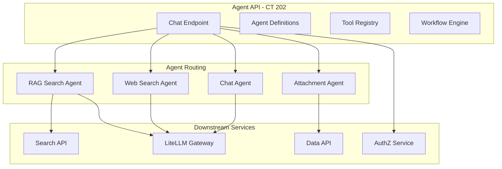

# Agent Service

**Created**: 2025-12-09  
**Last Updated**: 2026-02-12  
**Status**: Active  
**Category**: Architecture  
**Related Docs**:  
- `architecture/00-overview.md`  
- `architecture/02-ai.md`  
- `architecture/05-search.md`

## Service Placement
- **Container**: `agent-lxc` (CT 202)
- **Code**: `srv/agent`
- **Port**: 8000 (FastAPI)
- **Exposure**: Internal-only
- **Additional**: Docs API also runs on this container (port 8004)

## Agent Architecture

## Responsibilities
- Orchestrate agent-style requests (RAG + web + attachment decisions):
  - Accept user prompt, toggles (web/doc), attachments metadata.
  - Call Search API for retrieval (document-search tool).
  - Call liteLLM via OpenAI-compatible API for synthesis.
  - Enforce RBAC using the same JWT/role model as apps/search/ingest.
- Provide a stable surface for apps to invoke AI workflows without duplicating search/LLM calls.
- Manage agent definitions, conversations, workflows, and tools.

## Auth
- End-user JWT: RS256 tokens from AuthZ service (`iss=busibox-authz`, `aud=agent-api`).
- Token validation via JWKS from AuthZ service (`AUTHZ_JWKS_URL`).
- Token exchange: Agent service exchanges user tokens for service-specific tokens (e.g., `search-api`, `data-api`) via AuthZ token-exchange grant to call downstream services on behalf of the user.
- Scopes from JWT are stored in token grants for downstream calls.
- **Note**: OAuth2 scope-based operation authorization (e.g., `agent.execute`) is designed but not yet enforced. See `architecture/03-authentication.md` for current status.

## Built-in Agents (listed via `/admin/agents`)
- `rag-search-agent`: uses `document-search` tool; grounded answers with citations.
- `web-search-agent`: web search with configurable provider.
- `attachment-agent`: heuristic action/modelHint for attachments.
- `chat-agent`: final responder; uses provided doc/web/attachment context, avoids fabrication.

## Chat Endpoint
- **Path**: `POST /chat/message` (streaming: `POST /chat/message/stream`)
- **Behavior**: attachment decision -> optional doc search -> chat synthesis via liteLLM; streams tokens via SSE.
- **Inputs**: `content`, `enableDocumentSearch`, `enableWebSearch`, `attachmentIds?`, `model?`, `conversationId?`
- **Outputs**: streaming text + routing debug; doc results included in debug payload for UI display.

## Additional APIs (no `/api` prefix)
- `GET /agents` — list available agents
- `GET /conversations` — list conversations
- `POST /runs` — execute agent workflows
- `GET /agents/tools` — list available tools
- `GET /admin/agents` — admin view of agent definitions

**Detailed docs**: [services/agents/](../services/agents/01-overview.md)

## App Integration
- Apps exchange user session JWT for an `agent-api` audience token via AuthZ.
- Call `agent-api /api/chat` with the exchanged token, streaming the response to the UI.
- The `@jazzmind/busibox-app` library provides `AgentClient` and `SimpleChatInterface` for easy integration.

## Database
- Uses `agent` database in PostgreSQL.
- Schema managed via Alembic migrations (`srv/agent/alembic/`).
- Key tables: `agent_definitions`, `conversations`, `messages`, `tools`, `workflows`, `runs`, `run_outputs`, `run_tool_calls`.
