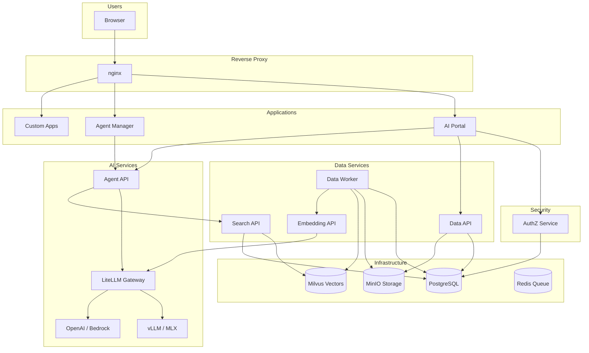

# Busibox Platform Overview

Busibox is a self-hosted AI infrastructure platform that gives your organization the full power of modern AI -- document processing, semantic search, intelligent agents, and custom applications -- while keeping your data private, secure, and under your control.

## What Makes Busibox Different

Most AI platforms force a choice: use a powerful cloud service and send your data to someone else, or run limited tools locally. Busibox eliminates that trade-off.

- **Your data stays yours.** Everything runs on your own infrastructure. Documents, conversations, and embeddings never leave your network.
- **Local and frontier AI, your choice.** Run open-source models locally on your own GPUs, use cloud providers like OpenAI or AWS Bedrock, or mix both -- per agent, per task.
- **Security by design.** Row-level security ensures users and agents only see the data they're authorized to access. No accidental data leakage through AI.
- **Build apps fast.** A library and app template let you vibe-code Next.js applications that instantly plug into the AI and data infrastructure.

## System Architecture

## Core Capabilities

### 1. Intelligent Document Processing

Upload documents in any format -- PDF, Word, images, spreadsheets -- and Busibox automatically extracts text, generates embeddings, and indexes everything for instant retrieval. Multiple extraction strategies (including AI-powered visual analysis) handle even the toughest documents.

**Learn more:** [Document Processing Pipeline](14-document-processing.md)

### 2. Semantic Search with RAG

Ask questions in natural language and get answers grounded in your actual documents. Hybrid search combines vector similarity with keyword matching, then reranks results for relevance. Agents use this same search to provide accurate, citation-backed responses.

### 3. AI Agents with Tools

Deploy agents that can search your documents, browse the web, and execute custom tools. Each agent can use different AI models -- a fast local model for simple tasks, a frontier model for complex reasoning -- all configured through a unified gateway.

**Learn more:** [Agent Tools and Capabilities](15-agent-tools.md)

### 4. Local and Frontier AI Models

Run open-source models on your own hardware (NVIDIA GPUs via vLLM, Apple Silicon via MLX) or connect to cloud providers. The liteLLM gateway presents a unified API, so switching models is a configuration change, not a code change.

**Learn more:** [Local and Frontier AI Models](11-ai-models.md)

### 5. Granular Security

Every API call carries a JWT with the user's roles. Services enforce Row-Level Security so users only see their own data and data shared with their roles. Agents inherit these same permissions -- they cannot access documents the user isn't authorized to see.

**Learn more:** [Security and Privacy](13-security.md)

### 6. Custom App Development

Build Next.js applications using the `@jazzmind/busibox-app` library and deploy them directly to the portal. Your app gets SSO authentication, RBAC authorization, document storage, AI agents, and semantic search -- all without writing a single line of infrastructure code.

**Learn more:** [Building Apps on Busibox](16-app-development.md)

## How It All Fits Together

A typical user interaction flows like this:

1. **User authenticates** via the AI Portal (passkey, TOTP, or magic link)
2. **Upload documents** -- they're stored in MinIO, processed by the data worker, embedded, and indexed in Milvus
3. **Search or chat** -- the user asks a question; the agent searches their authorized documents via hybrid search, synthesizes an answer using an LLM, and returns results with citations
4. **Build apps** -- developers create custom applications that leverage the same infrastructure through typed APIs and shared components

## Getting Started

- **Setup:** [Getting Started Guide](00-setup.md) -- install and configure the platform
- **Usage:** [Using Busibox Services](05-usage.md) -- learn the APIs and workflows
- **Developer Guide:** [Configuration](01-configuration.md) -- environment variables and secrets

## Feature Deep Dives

| Feature | Guide |
|---------|-------|
| AI model selection | [Local and Frontier AI Models](11-ai-models.md) |
| Unified data layer | [Unified Data Model](12-unified-data.md) |
| Security model | [Security and Privacy](13-security.md) |
| Document processing | [Document Processing Pipeline](14-document-processing.md) |
| Agent capabilities | [Agent Tools and Capabilities](15-agent-tools.md) |
| App development | [Building Apps on Busibox](16-app-development.md) |
