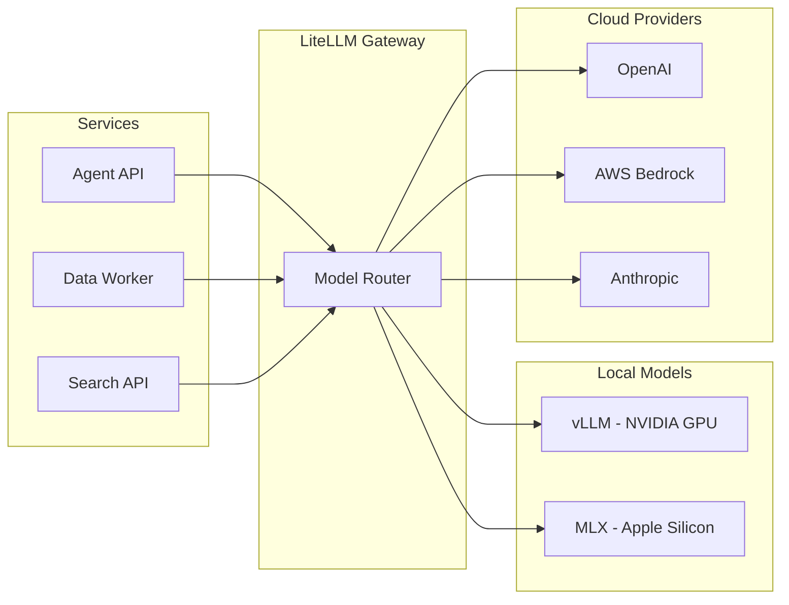

# Local and Frontier AI Models

Busibox gives you complete flexibility over which AI models power your agents and pipelines. Run open-source models locally for privacy and cost control, use frontier models from cloud providers for maximum capability, or mix both -- choosing the right model for each agent and each task.

## The Hybrid Approach

Instead of locking you into a single AI provider, Busibox uses a **LiteLLM gateway** that presents a unified OpenAI-compatible API to all services. Behind that gateway, you can configure any combination of model providers:

## Local Model Runtimes

### vLLM (NVIDIA GPUs)

vLLM is the primary local inference engine for systems with NVIDIA GPUs. It supports:

- High-throughput serving with continuous batching
- Quantized models (GPTQ, AWQ) for efficient memory usage
- Multiple concurrent requests with automatic scheduling
- OpenAI-compatible API out of the box

### MLX (Apple Silicon)

For development on Apple Silicon Macs, Busibox supports MLX through a host-agent bridge. MLX provides:

- Native Metal GPU acceleration
- Efficient memory-mapped model loading
- Fast inference for development and testing

The host-agent is necessary because MLX requires direct hardware access not available inside Docker containers. The Deploy API communicates with the host agent to manage MLX model serving.

## Cloud / Frontier Providers

Connect to any provider supported by LiteLLM:

- **OpenAI** -- GPT-4o, GPT-4o-mini, o1, o3
- **Anthropic** -- Claude Sonnet, Claude Opus
- **AWS Bedrock** -- Access to multiple model families
- **Google** -- Gemini models
- **And many more** -- Any OpenAI-compatible endpoint

## Per-Agent, Per-Task Model Selection

The real power is in the routing. Different agents and tasks can use different models:

| Task | Recommended Model | Why |
|------|-------------------|-----|
| Simple Q&A | Local (vLLM, fast model) | Low latency, no cost, private |
| Complex reasoning | Frontier (GPT-4o, Claude) | Higher capability |
| Document cleanup | Local (small model) | High volume, cost-sensitive |
| Reranking | Local or cloud | Depends on accuracy needs |
| Code generation | Frontier (Claude, GPT-4o) | Best results |
| Embeddings | Local (FastEmbed) | Always local, fast, free |

### How Model Routing Works

1. **Agent definitions** specify a default model (e.g., `gpt-4o-mini` or `local/llama-3.1`)
2. **LiteLLM configuration** maps model names to providers and endpoints
3. **Fallback chains** ensure requests succeed even if a provider is unavailable
4. **Users can override** the model per-conversation in supported UIs

## Embeddings

Embeddings are always generated locally using FastEmbed for speed and privacy:

- **Text embeddings**: `BAAI/bge-large-en-v1.5` (1024 dimensions) by default
- **Visual embeddings**: Optional ColPali for document images (runs on vLLM)
- **Hybrid search**: Both dense vectors and BM25 sparse signals are computed during ingestion

The embedding API runs as a dedicated service, ensuring consistent vector representations across ingestion and search.

## Reranking

After initial retrieval, results can be reranked using an LLM for improved relevance. Reranking is configured per-deployment:

- Enable/disable via `ENABLE_RERANKING`
- Choose the reranker model via `RERANKER_MODEL`
- Runs through the LiteLLM gateway, so it can use local or cloud models

## Cost and Privacy Tradeoffs

| Concern | Local Models | Cloud Models |
|---------|-------------|--------------|
| **Privacy** | Data never leaves your network | Data sent to provider |
| **Cost** | Hardware cost only (no per-token fees) | Pay per token |
| **Latency** | Depends on hardware | Typically fast |
| **Capability** | Good and improving rapidly | State of the art |
| **Availability** | Always available (your hardware) | Depends on provider |

Busibox lets you make this choice granularly. Use local models for routine tasks and sensitive data, frontier models for tasks that demand the highest quality -- all within the same platform.

## Configuration

Key environment variables for model configuration:

| Variable | Purpose |
|----------|---------|
| `LITELLM_BASE_URL` | LiteLLM gateway URL |
| `LITELLM_API_KEY` | Gateway API key |
| `AGENT_SERVER_DEFAULT_MODEL` | Default model for agents |
| `FASTEMBED_MODEL` | Text embedding model |
| `COLPALI_ENABLED` | Enable visual embeddings |
| `ENABLE_RERANKING` | Enable result reranking |
| `RERANKER_MODEL` | Model for reranking |

See the [Configuration Guide](01-configuration.md) for complete details.
