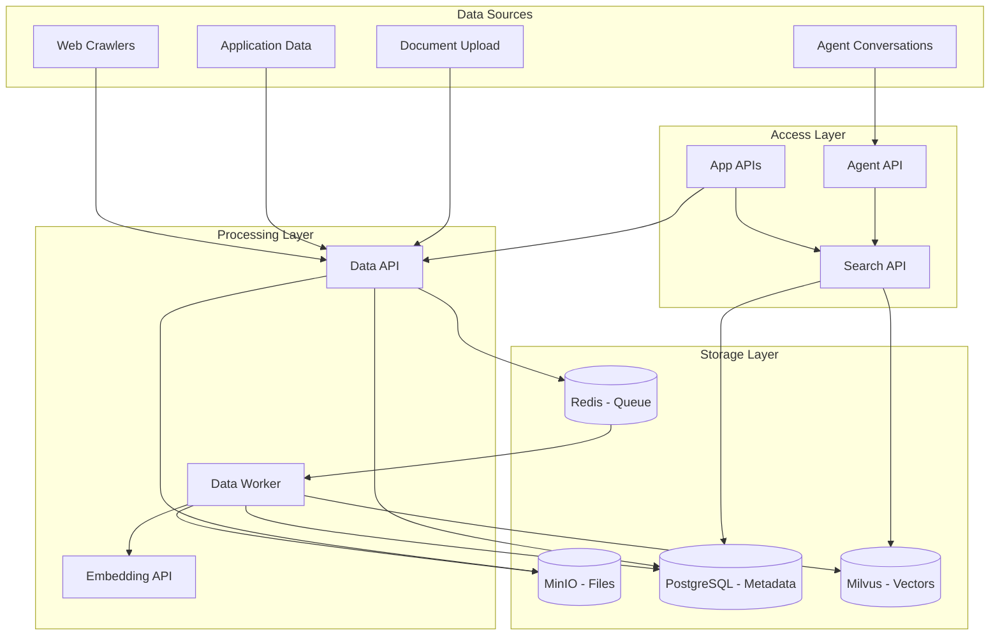

# Unified Data Model

Busibox provides a unified data layer that connects your documents, application data, and agent conversations. Upload a document, and it becomes searchable by agents. Store data from an app, and it can inform AI responses. Everything flows through the same secure, permission-aware infrastructure.

## The Big Picture

## Three Storage Tiers

### 1. Object Storage (MinIO)

Original files and derived artifacts are stored in MinIO, an S3-compatible object store:

- **Original documents** -- the uploaded file in its original format
- **Extracted markdown** -- the text extracted from each document
- **Page images** -- individual pages rendered for visual processing
- **Metadata** -- processing artifacts and intermediate results

Files are organized by user and file ID, with deduplication via SHA-256 content hashing.

### 2. Relational Database (PostgreSQL)

PostgreSQL stores structured metadata with Row-Level Security:

- **File metadata** -- upload date, status, visibility, roles
- **Processing history** -- which extraction strategies were used and their results
- **Text chunks** -- the chunked text with position information
- **Role assignments** -- which users and groups can access each document
- **Agent data** -- agent definitions, conversations, workflows
- **App data** -- structured data stored by custom applications

Each service has its own database for isolation (`files`, `agent_server`, `authz`, etc.), and RLS policies ensure data access respects user permissions.

### 3. Vector Database (Milvus)

Milvus stores vector embeddings for semantic search:

- **Dense vectors** -- 1024-dimensional embeddings from FastEmbed
- **Sparse vectors** -- BM25 signals for keyword matching
- **Visual vectors** -- optional ColPali embeddings for image-based search
- **Partitions** -- data is partitioned by user and role for access control

Partitions are the key security mechanism: when a user searches, only their personal partition and the partitions for their assigned roles are queried.

## Data Visibility Model

Every piece of data in Busibox has a visibility level:

| Visibility | Who Can Access | Milvus Partition |
|-----------|---------------|-----------------|
| **Personal** | Only the uploading user | `personal_{userId}` |
| **Shared** | Users with specified roles | `role_{roleId}` |

When you upload a document as "personal," only you can find it in search results and only your agents can reference it. When you share it with a role, anyone in that role can search it -- but nobody outside the role can.

## How Data Flows

### Document Upload Flow

1. **User uploads** a file through the AI Portal or an API call
2. **Data API** stores the file in MinIO and records metadata in PostgreSQL
3. **Job is queued** in Redis Streams for async processing
4. **Data Worker** picks up the job and runs the processing pipeline:
   - Text extraction (Marker, pdfplumber, or ColPali)
   - LLM cleanup (optional, for OCR artifacts)
   - Semantic chunking (400-800 tokens with overlap)
   - Embedding generation (FastEmbed dense + BM25 sparse)
   - Vector indexing in Milvus (partitioned by visibility)
5. **Document is searchable** -- agents and search queries can now find it

### Search and Retrieval Flow

1. **User or agent** submits a search query
2. **Search API** validates the JWT and builds the list of accessible partitions
3. **Hybrid search** runs against Milvus (semantic + keyword)
4. **Results are reranked** (optional, via LLM)
5. **Metadata is enriched** from PostgreSQL
6. **Results returned** -- only documents the user is authorized to see

### Application Data Flow

Applications built on Busibox can store structured data through the Data API:

1. **App stores data** via authenticated API calls
2. **Data is associated** with the user and their organization
3. **Data can be searched** alongside documents if indexed
4. **Agents can access** app data through tools, respecting the same permissions

## Chat With Your Documents

The unified data model is what makes "chat with your documents" work seamlessly:

1. You upload documents -- they get processed and indexed
2. You ask a question in the chat interface
3. The agent uses the Search API to find relevant chunks from your documents
4. The agent synthesizes an answer using the LLM, grounded in your actual data
5. Citations link back to the source documents

Because the search respects permissions, agents never leak data between users. Your personal documents stay personal, shared documents are only visible to authorized roles.

## Data From Multiple Sources

The same search and retrieval works regardless of where data originated:

- **Uploaded PDFs** -- extracted, chunked, and embedded
- **Web crawls** -- pages fetched and processed through the same pipeline
- **Application data** -- structured data stored by custom apps
- **Agent outputs** -- conversation history and generated artifacts

All of this data is searchable through the same API, with the same security model.

## Key APIs

| API | Purpose | Port |
|-----|---------|------|
| Data API | File upload, metadata, structured data | 8002 |
| Search API | Hybrid search, retrieval | 8003 |
| Embedding API | Vector generation | 8005 |
| Agent API | Chat, agent orchestration | 8000 |

See [Using Busibox Services](05-usage.md) for detailed API usage examples.
