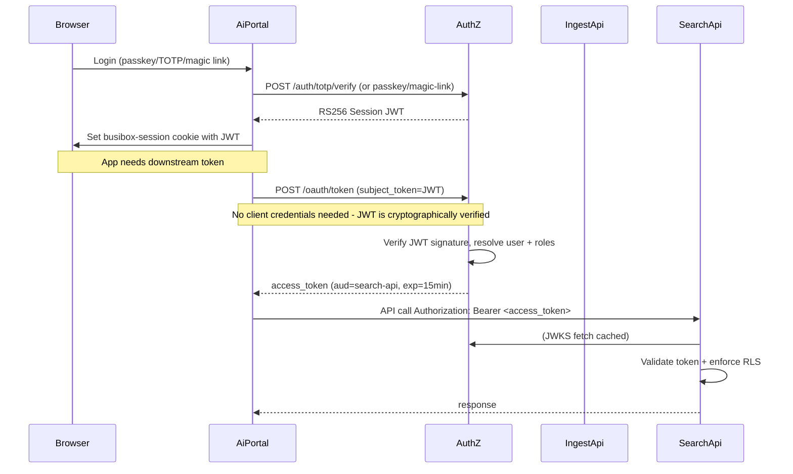

# OAuth2 Token Exchange Implementation Summary

## Overview

This document summarizes the implementation of OAuth2-aligned RBAC + token exchange for the Busibox platform.

> **Important Update (2026-01-15)**: Busibox now uses a Zero Trust authentication architecture where AuthZ issues all session JWTs directly. See `docs/architecture/03-authentication.md` for the authoritative architecture documentation.

## What Was Built

### Phase 0: Contracts (Already Complete)

The internal access token contract was already defined in `busibox/srv/authz/src/oauth/claims.py`:

- **Standard claims**: `iss`, `sub`, `aud`, `exp`, `iat`, `nbf`, `jti`
- **OAuth2 scopes**: `scope` (space-separated string)
- **RBAC compatibility**: `roles` array with `{id, name, permissions: [read|create|update|delete]}`
- **Optional IdP metadata**: `idp: {provider, tenantId, objectId}`

### Phase 1: AuthZ as OAuth2 Token Service

**Location**: `busibox/srv/authz/src/`

#### Key Management ✅

- **Asymmetric signing**: RS256 with 2048-bit RSA keys
- **JWKS endpoint**: `GET /.well-known/jwks.json`
- **Key rotation support**: Active/inactive key management
- **Optional encryption**: Private keys can be encrypted at rest

**Files**:
- `oauth/keys.py`: Key generation and management
- `services/postgres.py`: Key storage in `authz_signing_keys` table

#### OAuth2 Token Endpoint ✅

**Endpoint**: `POST /oauth/token`

**Supported grants**:
1. **client_credentials**: Service-to-service authentication
2. **token_exchange** (RFC 8693): On-behalf-of user tokens

**Features**:
- Client authentication via `client_id`/`client_secret`
- Audience validation (per-client allowed audiences)
- Scope validation (per-client allowed scopes)
- Short-lived tokens (default 15 minutes)
- Audit logging of token issuance

**Files**:
- `routes/oauth.py`: Token endpoint implementation
- `oauth/contracts.py`: Request/response models
- `oauth/client_auth.py`: PBKDF2-based secret hashing

#### OAuth Client Registry ✅

**Table**: `authz_oauth_clients`

**Fields**:
- `client_id`: Unique client identifier
- `client_secret_hash`: PBKDF2-hashed secret
- `allowed_audiences`: Array of permitted audiences
- `allowed_scopes`: Array of permitted scopes
- `is_active`: Enable/disable client

**Bootstrap**: Automatically creates `ai-portal` client on startup

#### RBAC Authority ✅

**Tables**:
- `authz_roles`: Role definitions
- `authz_users`: User records with IdP metadata
- `authz_user_roles`: User-role assignments

**Admin Endpoints**: `POST/GET/PUT/DELETE /admin/roles`, `/admin/user-roles`

**Authentication**: OAuth client credentials or admin token

**Files**:
- `routes/admin.py`: RBAC management endpoints
- `routes/internal.py`: User sync endpoint for ai-portal

### Phase 2: Downstream Service Validation

#### Ingest API ✅

**Already implemented** in `busibox/srv/ingest/src/api/middleware/jwt_auth.py`:

- JWKS-based validation using `PyJWKClient`
- Validates `iss`, `aud`, `exp`, `nbf`
- Extracts `roles` for PostgreSQL RLS
- Configurable via `AUTHZ_JWKS_URL`, `AUTHZ_ISSUER`, `AUTHZ_AUDIENCE`

#### Search API ✅

**Already implemented** in `busibox/srv/search/src/api/middleware/jwt_auth.py`:

- JWKS-based validation
- Extracts `roles` for Milvus partition filtering
- Same configuration as ingest-api

#### Agent API ✅

**Already implemented** in `busibox/srv/agent/app/auth/tokens.py`:

- JWKS-based validation with caching
- Token exchange client for downstream calls
- Configurable via `auth_jwks_url`, `auth_issuer`, `auth_audience`

### Phase 3: AI Portal Integration

#### AuthZ Client ✅

**Location**: `ai-portal/src/lib/authz-client.ts`

**Functions**:
- `syncUserToAuthz(userId)`: Sync user + roles to authz
- `exchangeDownstreamAccessToken(options)`: Get service-scoped token
- `getDownstreamAuthorizationHeader(options)`: Convenience wrapper

**BFF Endpoint**: `POST /api/authz/token` - Token exchange for client-side apps

#### Service Client Utilities ✅

**Location**: `ai-portal/src/lib/service-client.ts`

**Functions**:
- `getServiceBaseUrl(service)`: Get service URL from env
- `createServiceHeaders(options)`: Create authenticated headers
- `callService(options)`: Convenience wrapper for fetch

**Migration**: Example migration in `api/documents/search/route.ts`

**Documentation**: Complete migration guide in `ai-portal/docs/AUTHZ_MIGRATION_GUIDE.md`

### Phase 4: Busibox-App Token Manager

**Location**: `busibox-app/src/lib/authz/token-manager.ts`

**Features**:
- In-memory + sessionStorage caching
- Automatic expiry handling (60s buffer)
- Cache keyed by `(audience, scopes)`
- `fetchWithToken()` decorator for authenticated requests
- React hook: `useAuthzTokenManager()`

**Exports**: Available via `busibox-app` package

### Phase 5: Testing & Deployment

#### Integration Tests ✅

**Location**: `busibox/srv/authz/tests/`

**Test files**:
- `test_authz_service.py`: Core token exchange tests
- `test_admin_endpoints.py`: RBAC management tests
- `test_integration_token_flow.py`: End-to-end flow tests

**Coverage**:
- Complete token exchange flow
- Multiple roles per user
- Unknown user rejection
- Audience enforcement
- Client credentials flow
- Audit logging

#### Deployment Configuration ✅

**Documentation**: `busibox/docs/deployment/authz-deployment-config.md`

**Covers**:
- AuthZ service environment variables
- Downstream service configuration
- Container network setup
- Deployment steps
- Verification procedures
- Troubleshooting guide

## Architecture Diagram

> **Note**: This diagram shows the legacy flow. For the current Zero Trust architecture, see `docs/architecture/03-authentication.md`.



## Key Benefits

### Security

1. **Short-lived tokens**: 15-minute expiry reduces exposure
2. **Audience-bound**: Tokens can't be reused across services
3. **Asymmetric signing**: Private key never leaves authz
4. **Key rotation**: JWKS supports multiple active keys
5. **Audit trail**: All token issuance logged

### Scalability

1. **Stateless validation**: Services validate tokens locally via JWKS
2. **Caching**: JWKS cached for 5 minutes, tokens cached until expiry
3. **No shared secrets**: Each service validates independently
4. **Horizontal scaling**: AuthZ can scale behind load balancer

### Maintainability

1. **Centralized RBAC**: Single source of truth for roles
2. **Standard protocols**: OAuth2 + JWKS (industry standard)
3. **Clear contracts**: Well-defined token claims
4. **Gradual migration**: Legacy `X-User-Id` can coexist during transition

## Migration Status

### ✅ Complete

- [x] AuthZ service with OAuth2 token endpoint
- [x] JWKS endpoint and key management
- [x] OAuth client registry
- [x] RBAC admin endpoints
- [x] Downstream service JWKS validation (ingest, search, agent)
- [x] AI Portal authz client
- [x] Service client utilities
- [x] Busibox-app token manager
- [x] Integration tests
- [x] Deployment documentation
- [x] **Zero Trust Architecture** - AuthZ issues session JWTs directly
- [x] **Subject Token Exchange** - User operations use session JWT as subject_token
- [x] **Delegation Tokens** - Background tasks use explicit user delegation

### 🚧 In Progress

- [ ] Deploy authz service to test environment
- [ ] Update Ansible playbooks with authz configuration

### 📋 Planned

- [ ] Deploy to production
- [ ] Remove legacy `X-User-Id` support from services
- [ ] Add Grafana dashboards for token metrics
- [ ] Add external IdP integration (validate upstream tokens)

## Files Created/Modified

### New Files

**AuthZ Service**:
- `busibox/srv/authz/src/routes/admin.py`
- `busibox/srv/authz/tests/test_admin_endpoints.py`
- `busibox/srv/authz/tests/test_integration_token_flow.py`

**AI Portal**:
- `ai-portal/src/lib/service-client.ts`
- `ai-portal/docs/AUTHZ_MIGRATION_GUIDE.md`

**Busibox-App**:
- `busibox-app/src/lib/authz/token-manager.ts`
- `busibox-app/src/lib/authz/index.ts`

**Documentation**:
- `busibox/docs/deployment/authz-deployment-config.md`
- `busibox/docs/guides/oauth2-token-exchange-implementation.md`

### Modified Files

**AuthZ Service**:
- `busibox/srv/authz/src/main.py`: Added admin router
- `busibox/srv/authz/src/services/postgres.py`: Added RBAC methods

**AI Portal**:
- `ai-portal/src/app/api/documents/search/route.ts`: Example migration
- `busibox-app/src/index.ts`: Export authz utilities

## Next Steps

### Immediate (Week 1)

1. **Deploy authz to test environment**:
   ```bash
   cd /root/busibox/provision/ansible
   make authz INV=inventory/test
   ```

2. **Update test services with authz config**:
   ```bash
   make ingest INV=inventory/test
   make search INV=inventory/test
   make agent INV=inventory/test
   make apps INV=inventory/test
   ```

3. **Verify token exchange works**:
   ```bash
   bash scripts/test-authz-integration.sh
   ```

### Short-term (Week 2-3)

4. **Migrate high-traffic ai-portal routes**:
   - Document upload/download
   - Search endpoints
   - Chat/agent endpoints

5. **Monitor token metrics**:
   - Exchange request rate
   - Validation failures
   - Cache hit rate

6. **Deploy to production**:
   ```bash
   cd /root/busibox/provision/ansible
   make authz
   make all  # Update all services
   ```

### Long-term (Month 2+)

7. **Remove legacy support**:
   - Deprecate `X-User-Id` header
   - Remove `ALLOW_LEGACY_AUTH` flags
   - Clean up legacy code

8. **Advanced features**:
   - Token revocation
   - External IdP integration
   - Refresh token support (if needed)

## Troubleshooting

### Common Issues

**Token exchange fails with 401**:
- Check `AUTHZ_CLIENT_SECRET` matches vault
- Ensure user synced to authz first

**Service rejects token**:
- Verify `AUTHZ_JWKS_URL` points to authz
- Check `AUTHZ_ISSUER` and `AUTHZ_AUDIENCE` match

**RLS not working**:
- Ensure user roles synced to authz
- Verify token contains `roles` claim

### Debug Commands

```bash
# Check authz service
ssh root@10.96.200.210
systemctl status authz
journalctl -u authz -n 50

# Test JWKS endpoint
curl http://10.96.200.210:8010/.well-known/jwks.json | jq

# Test token exchange
curl -X POST http://10.96.200.210:8010/oauth/token \
  -H "Content-Type: application/json" \
  -d '{"grant_type":"client_credentials","client_id":"ai-portal","client_secret":"<secret>","audience":"ingest-api"}'

# Decode token
TOKEN="<access-token>"
echo $TOKEN | cut -d. -f2 | base64 -d | jq
```

## Related Documentation

- **Plan**: `evolve_authz_to_oauth2_token-exchange_f02bec2c.plan.md`
- **Deployment**: `docs/deployment/authz-deployment-config.md`
- **Migration**: `ai-portal/docs/AUTHZ_MIGRATION_GUIDE.md`
- **AuthZ Service**: `srv/authz/README.md`
- **Token Manager**: `busibox-app/src/lib/authz/token-manager.ts`

## Rules Used

Following Busibox organization rules:

- **Documentation**: Placed in `docs/guides/` (how-to guide)
- **Deployment docs**: Placed in `docs/deployment/` (deployment procedures)
- **Script organization**: N/A (no new scripts created)
- **Naming**: Used `kebab-case` for all files
- **Metadata**: Included frontmatter with category, dates, status

## Summary

The OAuth2 token exchange implementation is **complete and ready for deployment**. All planned phases have been implemented:

✅ AuthZ service with OAuth2 endpoints
✅ JWKS-based validation in all services  
✅ AI Portal integration with authz client
✅ Busibox-app token manager utilities
✅ Comprehensive tests and documentation

The system is now ready for:
1. Test environment deployment
2. Gradual migration of ai-portal routes
3. Production rollout

This implementation provides a **secure, scalable, and maintainable** foundation for Busibox authentication and authorization.

