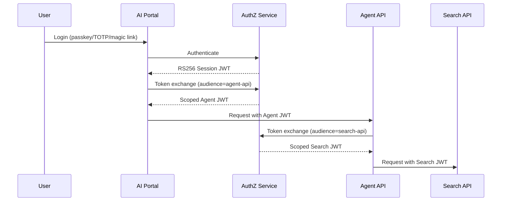

# Security Architecture

[Back to Why Busibox](00-why-busibox.md)

## Security Is Not a Feature — It's the Foundation

Many AI platforms bolt security on as an afterthought: shared document pools with basic permissions, API keys passed around in environment variables, and "trust the app layer" as the enforcement model. Busibox takes a fundamentally different approach. Security is built into every layer of the architecture — from the database engine up through the AI agents.

## Zero Trust Authentication

Busibox implements a true Zero Trust architecture. There are no static admin tokens, no shared API keys, and no trusted internal networks. Every request, from every service, is authenticated cryptographically.

**How it works:**

1. Users authenticate via passkey, TOTP, or magic link through the AuthZ service.
2. AuthZ issues an RS256-signed JWT (session token) — the only authentication authority in the system.
3. When a user accesses a downstream service (Agent API, Data API, Search API), their session JWT is exchanged for a service-specific token with scoped permissions.
4. Every service validates tokens by verifying the RS256 signature via JWKS — no database lookups required for basic validation.
5. Background tasks and service-to-service calls use service account JWTs — never static credentials.

Each token is audience-bound (a token issued for the Agent API cannot be used against the Data API), time-limited, and carries the user's identity and roles. Token revocation is supported via JTI tracking for immediate session invalidation.

## Row-Level Security

Most platforms enforce access control in the application layer. If there's a bug in the application code — an API that forgets to filter by user, a query that accidentally returns all rows — data leaks.

Busibox enforces access control at the database level using PostgreSQL Row-Level Security (RLS). Every query to PostgreSQL runs with session variables (`app.user_id`, `app.user_role_ids`) that restrict which rows are visible. This happens below the application layer: even if application code contains a bug, the database itself will not return unauthorized rows.

**What this means in practice:**

- A user querying documents will only see their personal documents and documents shared with their roles — enforced by PostgreSQL, not application code.
- An agent serving a user inherits that user's permissions. The agent cannot retrieve documents the user cannot access, because the same RLS policies govern the agent's database queries.
- Search results from Milvus are filtered by partition (one per user and per role). You cannot search across partitions you don't have access to.

## Container Isolation

Each Busibox service runs in its own isolated container (LXC on Proxmox, or Docker):

| Container | Services | Isolation Boundary |
|-----------|----------|-------------------|
| proxy-lxc | nginx (TLS termination) | Network entry point; no direct database access |
| core-apps-lxc | AI Portal, Agent Manager | Application layer; accesses APIs only |
| agent-lxc | Agent API, Docs API | AI orchestration; no direct database writes |
| data-lxc | Data API, Worker, Embedding API, Redis | Document processing; dedicated database access |
| milvus-lxc | Milvus, Search API | Vector search; partition-isolated |
| pg-lxc | PostgreSQL | Database; RLS enforced |
| files-lxc | MinIO | Object storage; credential-gated |
| authz-lxc | AuthZ, Deploy API | Authentication authority |
| user-apps-lxc | User-deployed applications | Sandboxed; API access only |

Containers share nothing beyond the bridge network. A compromise in one container does not grant access to another container's data or services. Each container has its own filesystem, process space, and resource limits.

## Role-Based Access Control

Busibox uses a role-based model that governs access across the entire platform:

- **Document visibility**: Documents are either personal (visible only to the owner) or shared with specific roles. Users see their personal documents plus documents shared with any role they belong to.
- **Agent permissions**: Agents inherit the requesting user's roles. When an agent searches documents or retrieves data, it operates under the user's permission set.
- **Application access**: Apps are assigned to roles. Users can only access apps that are assigned to at least one of their roles.
- **Administrative functions**: User management, role configuration, model settings, and app deployment require the Admin role.

Roles are defined per organization, and a user can hold multiple roles. The permission model is additive — roles grant access, they never restrict access granted by another role.

## Secrets Management

Infrastructure secrets (database passwords, API keys, service credentials) are stored in Ansible Vault — encrypted at rest and injected at deployment time. Secrets never appear in source code, environment files committed to version control, or container images. The `make` command interface ensures that secrets are properly injected for every service operation.

## Audit Trail

Authentication events, token exchanges, and administrative actions are logged to PostgreSQL with timestamps, user identifiers, IP addresses, and action details. Audit records are queryable through standard SQL and can be integrated with external logging and SIEM systems.

## Further Reading

- [Data Sovereignty](01-data-sovereignty.md) — How your data stays under your control
- [Hybrid AI](03-hybrid-ai.md) — Sensitivity-aware model routing
- [Platform Capabilities](04-platform-capabilities.md) — How security integrates with search, agents, and apps
