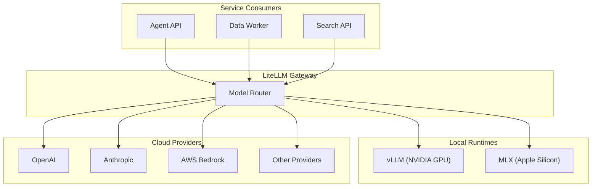

# Hybrid AI: Local and Cloud

[Back to Why Busibox](00-why-busibox.md)

## The Problem with Single-Provider AI

Most AI platforms force a binary choice: use a powerful cloud model and accept the data sovereignty trade-offs, or run a local model and accept the capability limitations. Neither extreme serves organizations well.

Cloud-only means every query, every document, and every conversation passes through a third-party provider. Local-only means accepting whatever model fits your hardware, even when a more capable model would produce better results for a specific task.

## How Busibox Handles It

Busibox uses a **LiteLLM gateway** as a single routing layer between all AI consumers (agents, search, document processing) and all model providers. This gateway presents a unified OpenAI-compatible API to internal services, while routing requests to the right model based on configuration, task requirements, and data sensitivity.

Services never call models directly. They make requests to the LiteLLM gateway, which handles model selection, load balancing, failover, and provider-specific API translation. This means:

- Switching models requires a configuration change, not a code change.
- Adding a new provider (or removing one) does not affect any application or agent.
- Different agents can use different models without any application-level complexity.

## Local Model Runtimes

Busibox supports two local inference runtimes:

### vLLM (NVIDIA GPUs)

The primary runtime for GPU-equipped servers. vLLM provides:

- High-throughput inference with continuous batching
- Support for quantized models (GPTQ, AWQ) to fit larger models in available VRAM
- Runs inside a container with GPU passthrough
- Minimum requirement: NVIDIA GPU with 24 GB VRAM (e.g., RTX 3090, RTX 4090, A5000)

### MLX (Apple Silicon)

For development environments or smaller deployments on Mac hardware. MLX provides:

- Native Metal GPU acceleration on Apple Silicon
- Efficient use of unified memory (CPU and GPU share the same memory pool)
- Runs on the host via a bridge agent, since MLX requires direct hardware access
- Minimum requirement: Apple Silicon with 24 GB unified memory (e.g., M4 Pro, M4 Max)

## Cloud Providers

When local models are insufficient for a task — long-context analysis, multimodal reasoning, or tasks requiring frontier-level capability — Busibox routes to cloud providers through the same gateway:

- **OpenAI** (GPT-4, GPT-4o, etc.)
- **Anthropic** (Claude)
- **AWS Bedrock** (multiple model families)
- Any provider with an OpenAI-compatible API

Cloud providers are configured once in the LiteLLM gateway. No application or agent needs to know which provider is being used — they just request a model capability, and the gateway routes accordingly.

## Sensitivity-Aware Routing

The hybrid architecture becomes especially powerful when combined with Busibox's [data sovereignty](01-data-sovereignty.md) features:

- **Folder-level sensitivity classification** determines which models may process documents from that folder. Documents in "local LLM only" folders are never sent to cloud providers, regardless of which model might produce better results.
- **Per-agent model selection** allows administrators to assign specific models to specific agents. A legal review agent handling confidential contracts can be locked to a local model, while a general research agent can use frontier models.
- **Automatic fallback** (on the roadmap) will route to frontier models for tasks that exceed local model capabilities — such as very long context windows or vision tasks — while respecting sensitivity constraints.

## Cost Optimization

Running a hybrid stack provides natural cost optimization:

- **Routine tasks locally**: Chat responses, document summarization, and search reranking use local models at zero marginal cost per query. Once the hardware investment is made, inference is essentially free.
- **Complex tasks in the cloud**: Long-context analysis, multi-step reasoning, and specialized tasks use frontier models only when the local model would produce significantly worse results.
- **Embedding on CPU**: Text embeddings (FastEmbed) run on CPU, requiring no GPU allocation. This means embedding generation runs in parallel with LLM inference without competing for GPU resources.

For many deployments, 90%+ of AI tasks can be handled by local models, with cloud providers reserved for edge cases. The exact ratio depends on the use case and the capability of the local model.

## What This Means in Practice

- A user chatting with an agent about their documents gets fast responses from a local model — no cloud latency, no data leaving the network.
- When the same user asks a question that requires analyzing a 100-page document against web research, the system can route to a frontier model with a larger context window.
- An administrator can see exactly which models are being used, adjust routing rules, and add or remove providers without touching any application code.
- The organization pays for cloud AI only when local models genuinely cannot handle the task.

## Further Reading

- [Data Sovereignty](01-data-sovereignty.md) — Sensitivity classification and local-only processing
- [Security Architecture](02-security-architecture.md) — How authentication flows through the model gateway
- [Platform Capabilities](04-platform-capabilities.md) — How hybrid AI powers document processing, search, and agents
