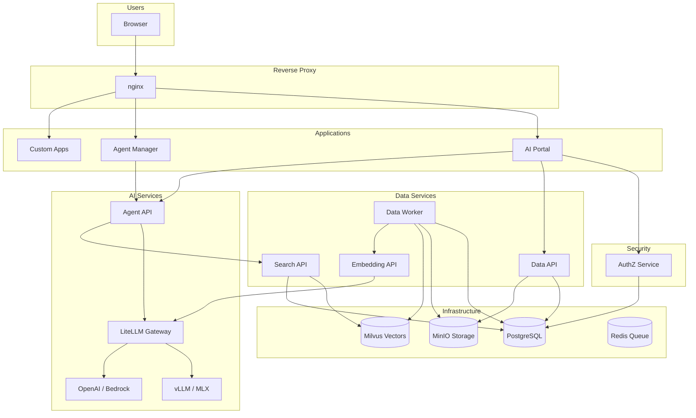

# Platform Overview

Busibox is a self-hosted AI platform that gives your organization document processing, semantic search, AI agents, and custom applications — while keeping your data private and under your control.

## What Busibox Does

Busibox combines several capabilities into one platform:

- **Document processing** — Upload PDFs, Word files, spreadsheets, images, and more. The system extracts text, chunks it, and makes it searchable.
- **Semantic search** — Ask questions in natural language and get answers grounded in your documents. No need to remember exact keywords.
- **AI agents** — Chat with assistants that can search your documents, browse the web, and help with tasks.
- **Custom apps** — Specialized tools like Status Report and Estimator run on the same platform, with the same security and data access.

## Why It Matters

Most AI platforms force a choice: use a powerful cloud service and send your data elsewhere, or run limited tools locally. Busibox removes that trade-off.

- **Your data stays private.** Everything runs on your organization's infrastructure. Documents, conversations, and search indexes stay on your network.
- **Local and cloud AI.** Your admin can configure local models for speed and privacy, cloud models for complex tasks, or a mix of both.
- **Security by design.** You only see documents you're allowed to see. Agents respect the same permissions — they can't access data you can't access.

## Core Capabilities

| Capability | What it means for you |
|-----------|------------------------|
| **Document processing** | Upload almost any file format. The system handles extraction, chunking, and indexing automatically. |
| **Semantic search** | Ask questions in plain language. The system finds relevant passages even when you don't use the exact words from the document. |
| **AI agents** | Chat with assistants that search your documents, browse the web, and answer questions with citations. |
| **Custom apps** | Use specialized apps (project tracking, cost estimation, etc.) that share your authentication and document access. |

## How the Platform Fits Together

The diagram below shows how the main pieces connect. As a user, you interact with the apps (AI Portal, Agent Manager, etc.). Those apps talk to AI services, data services, and security — all behind the scenes.

## Typical User Flow

A typical session looks like this:

1. **Authenticate** — Log in to the AI Portal with passkey, TOTP, or magic link.
2. **Upload** — Add documents. They're stored, processed, and indexed automatically.
3. **Search or chat** — Ask questions. The system finds relevant passages and, when you use an agent, synthesizes answers with citations.
4. **Use apps** — Open Agent Manager, Status Report, Estimator, or other apps. They use the same documents and permissions.

Everything is connected: your documents power search and agents, and your permissions control what you can see across the platform.
